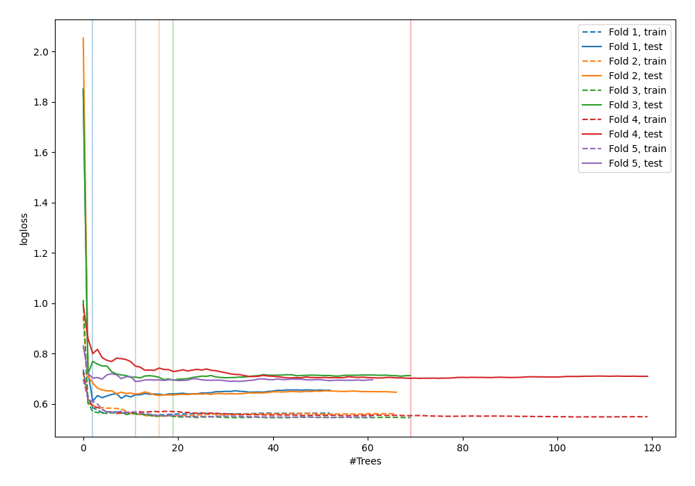

# Summary of 47_RandomForest

[<< Go back](../README.md)

## Random Forest
- **n_jobs**: -1
- **criterion**: gini
- **max_features**: 0.5
- **min_samples_split**: 50
- **max_depth**: 5
- **explain_level**: 0

## Validation
 - **validation_type**: kfold
 - **shuffle**: True
 - **stratify**: True
 - **k_folds**: 5

## Optimized metric
logloss

## Training time

3.5 seconds

## Metric details
|           |    score |   threshold |
|:----------|---------:|------------:|
| logloss   | 0.665717 |  nan        |
| auc       | 0.628109 |  nan        |
| f1        | 0.675749 |    0.343225 |
| accuracy  | 0.592727 |    0.446546 |
| precision | 0.8      |    0.686681 |
| recall    | 1        |    0.118854 |
| mcc       | 0.211654 |    0.343225 |

## Confusion matrix (at threshold=0.446546)
|                     |   Predicted as negative |   Predicted as positive |
|:--------------------|------------------------:|------------------------:|
| Labeled as negative |                      67 |                      74 |
| Labeled as positive |                      38 |                      96 |

## Learning curves

[<< Go back](../README.md)
