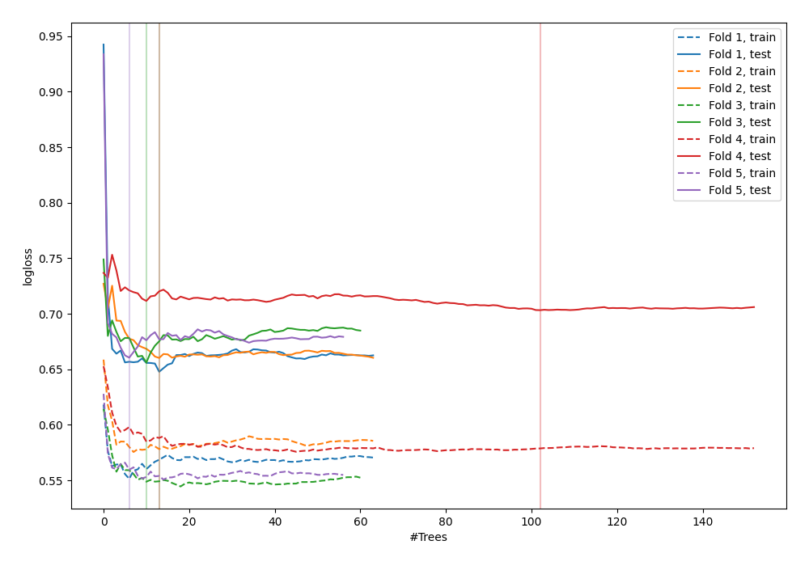

# Summary of 48_ExtraTrees

[<< Go back](../README.md)

## Extra Trees Classifier (Extra Trees)
- **n_jobs**: -1
- **criterion**: gini
- **max_features**: 0.5
- **min_samples_split**: 20
- **max_depth**: 4
- **explain_level**: 0

## Validation
 - **validation_type**: kfold
 - **shuffle**: True
 - **stratify**: True
 - **k_folds**: 5

## Optimized metric
logloss

## Training time

3.3 seconds

## Metric details
|           |    score |   threshold |
|:----------|---------:|------------:|
| logloss   | 0.665569 |  nan        |
| auc       | 0.637292 |  nan        |
| f1        | 0.664935 |    0.316173 |
| accuracy  | 0.621818 |    0.50417  |
| precision | 0.888889 |    0.626478 |
| recall    | 1        |    0.144776 |
| mcc       | 0.242536 |    0.50417  |

## Confusion matrix (at threshold=0.50417)
|                     |   Predicted as negative |   Predicted as positive |
|:--------------------|------------------------:|------------------------:|
| Labeled as negative |                      92 |                      49 |
| Labeled as positive |                      55 |                      79 |

## Learning curves

[<< Go back](../README.md)
