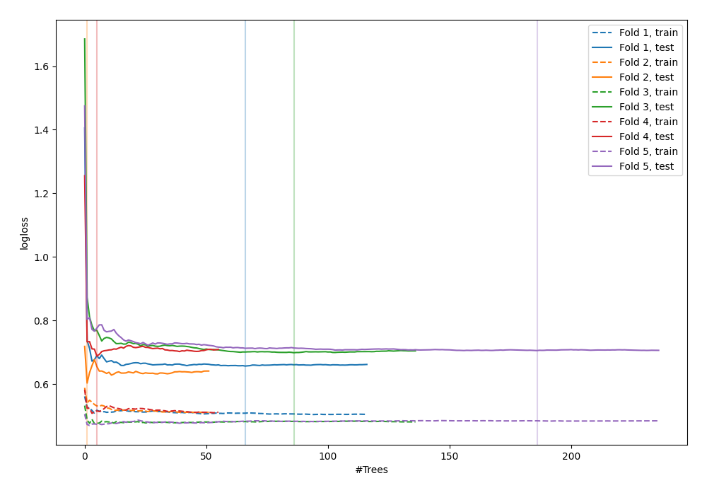

# Summary of 49_ExtraTrees

[<< Go back](../README.md)

## Extra Trees Classifier (Extra Trees)
- **n_jobs**: -1
- **criterion**: gini
- **max_features**: 0.7
- **min_samples_split**: 30
- **max_depth**: 7
- **explain_level**: 0

## Validation
 - **validation_type**: kfold
 - **shuffle**: True
 - **stratify**: True
 - **k_folds**: 5

## Optimized metric
logloss

## Training time

4.9 seconds

## Metric details
|           |    score |   threshold |
|:----------|---------:|------------:|
| logloss   | 0.670773 | nan         |
| auc       | 0.614031 | nan         |
| f1        | 0.674095 |   0.366872  |
| accuracy  | 0.596364 |   0.616707  |
| precision | 0.818182 |   0.720019  |
| recall    | 1        |   0.0833333 |
| mcc       | 0.217113 |   0.616707  |

## Confusion matrix (at threshold=0.616707)
|                     |   Predicted as negative |   Predicted as positive |
|:--------------------|------------------------:|------------------------:|
| Labeled as negative |                     123 |                      18 |
| Labeled as positive |                      93 |                      41 |

## Learning curves

[<< Go back](../README.md)
