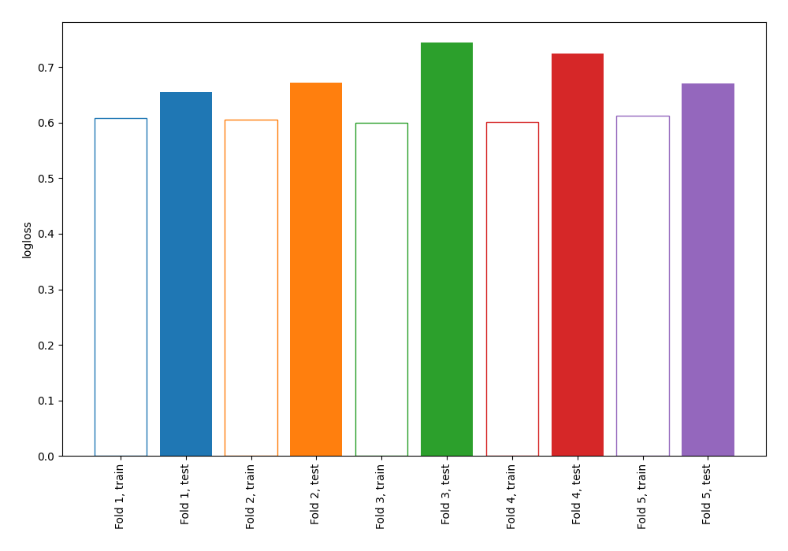

# Summary of 4_Linear

[<< Go back](../README.md)

## Logistic Regression (Linear)
- **n_jobs**: -1
- **explain_level**: 0

## Validation
 - **validation_type**: kfold
 - **shuffle**: True
 - **stratify**: True
 - **k_folds**: 5

## Optimized metric
logloss

## Training time

3.2 seconds

## Metric details
|           |    score |   threshold |
|:----------|---------:|------------:|
| logloss   | 0.693097 | nan         |
| auc       | 0.615381 | nan         |
| f1        | 0.67027  |   0.299371  |
| accuracy  | 0.610909 |   0.521905  |
| precision | 0.644737 |   0.599879  |
| recall    | 1        |   0.0133904 |
| mcc       | 0.221128 |   0.521905  |

## Confusion matrix (at threshold=0.521905)
|                     |   Predicted as negative |   Predicted as positive |
|:--------------------|------------------------:|------------------------:|
| Labeled as negative |                      99 |                      42 |
| Labeled as positive |                      65 |                      69 |

## Learning curves

[<< Go back](../README.md)
