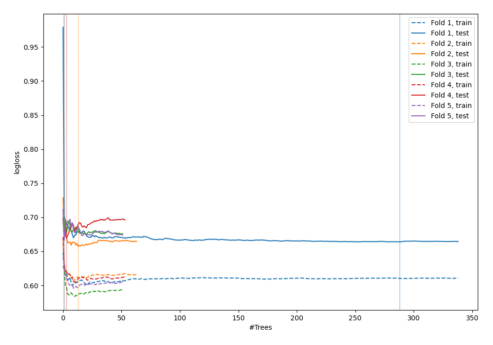

# Summary of 50_ExtraTrees

[<< Go back](../README.md)

## Extra Trees Classifier (Extra Trees)
- **n_jobs**: -1
- **criterion**: gini
- **max_features**: 0.8
- **min_samples_split**: 40
- **max_depth**: 3
- **explain_level**: 0

## Validation
 - **validation_type**: kfold
 - **shuffle**: True
 - **stratify**: True
 - **k_folds**: 5

## Optimized metric
logloss

## Training time

4.3 seconds

## Metric details
|           |    score |   threshold |
|:----------|---------:|------------:|
| logloss   | 0.66509  |  nan        |
| auc       | 0.622076 |  nan        |
| f1        | 0.682171 |    0.324735 |
| accuracy  | 0.596364 |    0.502857 |
| precision | 0.727273 |    0.609202 |
| recall    | 1        |    0.197135 |
| mcc       | 0.233838 |    0.324735 |

## Confusion matrix (at threshold=0.502857)
|                     |   Predicted as negative |   Predicted as positive |
|:--------------------|------------------------:|------------------------:|
| Labeled as negative |                      88 |                      53 |
| Labeled as positive |                      58 |                      76 |

## Learning curves

[<< Go back](../README.md)
