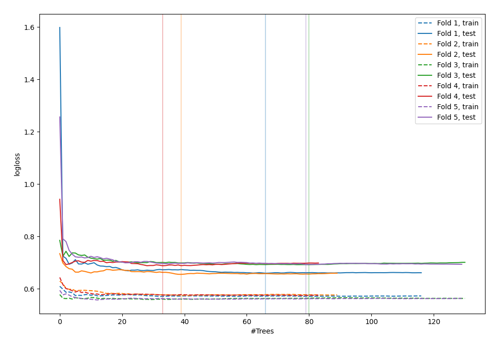

# Summary of 51_ExtraTrees

[<< Go back](../README.md)

## Extra Trees Classifier (Extra Trees)
- **n_jobs**: -1
- **criterion**: entropy
- **max_features**: 0.6
- **min_samples_split**: 50
- **max_depth**: 6
- **explain_level**: 0

## Validation
 - **validation_type**: kfold
 - **shuffle**: True
 - **stratify**: True
 - **k_folds**: 5

## Optimized metric
logloss

## Training time

4.3 seconds

## Metric details
|           |    score |   threshold |
|:----------|---------:|------------:|
| logloss   | 0.677425 |  nan        |
| auc       | 0.59675  |  nan        |
| f1        | 0.668354 |    0.296475 |
| accuracy  | 0.581818 |    0.521538 |
| precision | 0.666667 |    0.670757 |
| recall    | 1        |    0.192038 |
| mcc       | 0.172262 |    0.436734 |

## Confusion matrix (at threshold=0.521538)
|                     |   Predicted as negative |   Predicted as positive |
|:--------------------|------------------------:|------------------------:|
| Labeled as negative |                      96 |                      45 |
| Labeled as positive |                      70 |                      64 |

## Learning curves

[<< Go back](../README.md)
