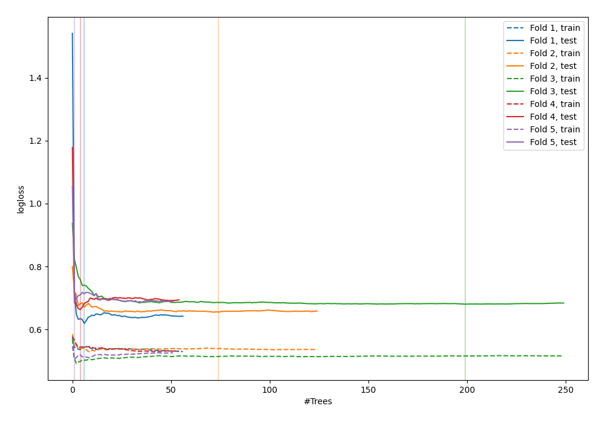

# Summary of 53_ExtraTrees

[<< Go back](../README.md)

## Extra Trees Classifier (Extra Trees)
- **n_jobs**: -1
- **criterion**: gini
- **max_features**: 1.0
- **min_samples_split**: 40
- **max_depth**: 7
- **explain_level**: 0

## Validation
 - **validation_type**: kfold
 - **shuffle**: True
 - **stratify**: True
 - **k_folds**: 5

## Optimized metric
logloss

## Training time

4.3 seconds

## Metric details
|           |    score |   threshold |
|:----------|---------:|------------:|
| logloss   | 0.66037  | nan         |
| auc       | 0.650736 | nan         |
| f1        | 0.687679 |   0.364582  |
| accuracy  | 0.618182 |   0.519689  |
| precision | 0.809524 |   0.697838  |
| recall    | 1        |   0.0764706 |
| mcc       | 0.268384 |   0.364582  |

## Confusion matrix (at threshold=0.519689)
|                     |   Predicted as negative |   Predicted as positive |
|:--------------------|------------------------:|------------------------:|
| Labeled as negative |                      98 |                      43 |
| Labeled as positive |                      62 |                      72 |

## Learning curves

[<< Go back](../README.md)
