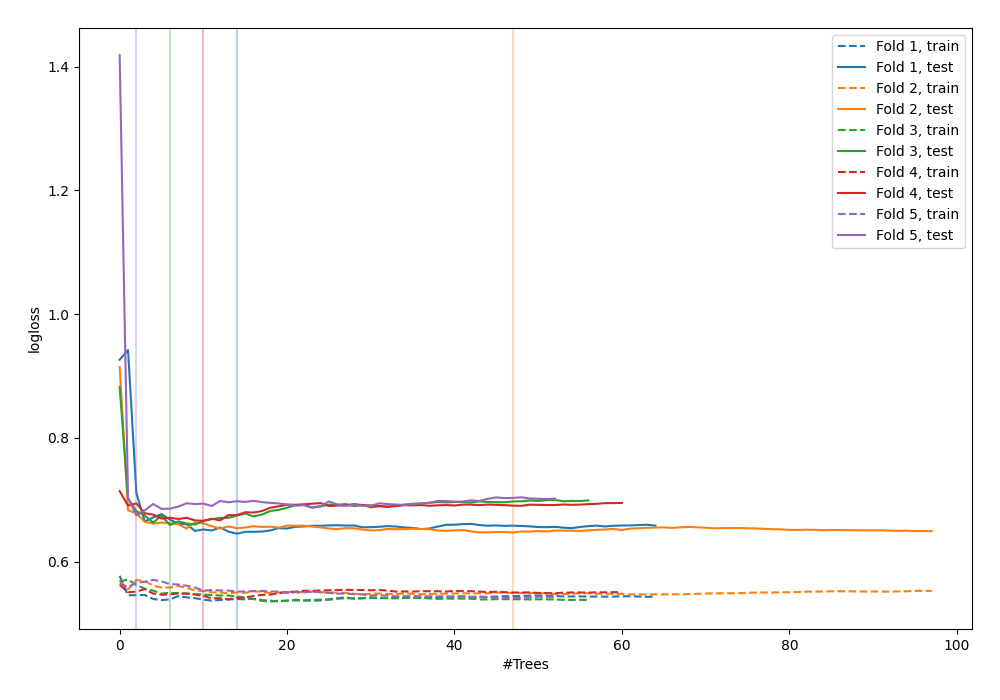

# Summary of 53_ExtraTrees_SelectedFeatures

[<< Go back](../README.md)

## Extra Trees Classifier (Extra Trees)
- **n_jobs**: -1
- **criterion**: gini
- **max_features**: 1.0
- **min_samples_split**: 40
- **max_depth**: 7
- **explain_level**: 0

## Validation
 - **validation_type**: kfold
 - **shuffle**: True
 - **stratify**: True
 - **k_folds**: 5

## Optimized metric
logloss

## Training time

2.7 seconds

## Metric details
|           |    score |   threshold |
|:----------|---------:|------------:|
| logloss   | 0.658515 |  nan        |
| auc       | 0.655499 |  nan        |
| f1        | 0.675676 |    0.309343 |
| accuracy  | 0.647273 |    0.542555 |
| precision | 0.684211 |    0.611827 |
| recall    | 1        |    0.139983 |
| mcc       | 0.296376 |    0.542555 |

## Confusion matrix (at threshold=0.542555)
|                     |   Predicted as negative |   Predicted as positive |
|:--------------------|------------------------:|------------------------:|
| Labeled as negative |                     106 |                      35 |
| Labeled as positive |                      62 |                      72 |

## Learning curves

[<< Go back](../README.md)
