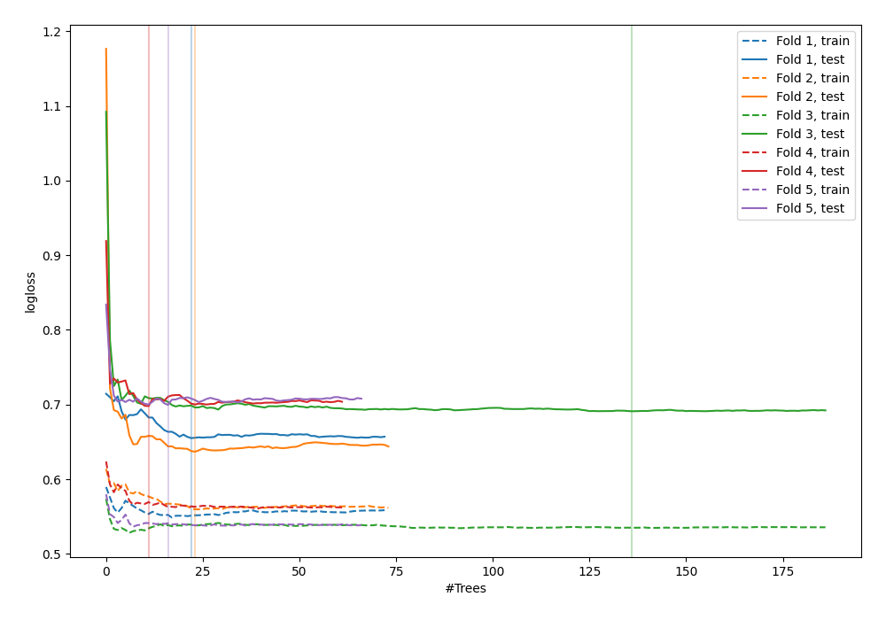

# Summary of 54_ExtraTrees

[<< Go back](../README.md)

## Extra Trees Classifier (Extra Trees)
- **n_jobs**: -1
- **criterion**: gini
- **max_features**: 0.9
- **min_samples_split**: 40
- **max_depth**: 5
- **explain_level**: 0

## Validation
 - **validation_type**: kfold
 - **shuffle**: True
 - **stratify**: True
 - **k_folds**: 5

## Optimized metric
logloss

## Training time

3.6 seconds

## Metric details
|           |    score |   threshold |
|:----------|---------:|------------:|
| logloss   | 0.676104 |  nan        |
| auc       | 0.616757 |  nan        |
| f1        | 0.663342 |    0.236211 |
| accuracy  | 0.618182 |    0.493725 |
| precision | 0.636364 |    0.666629 |
| recall    | 1        |    0.18342  |
| mcc       | 0.237649 |    0.481722 |

## Confusion matrix (at threshold=0.493725)
|                     |   Predicted as negative |   Predicted as positive |
|:--------------------|------------------------:|------------------------:|
| Labeled as negative |                      90 |                      51 |
| Labeled as positive |                      54 |                      80 |

## Learning curves

[<< Go back](../README.md)
