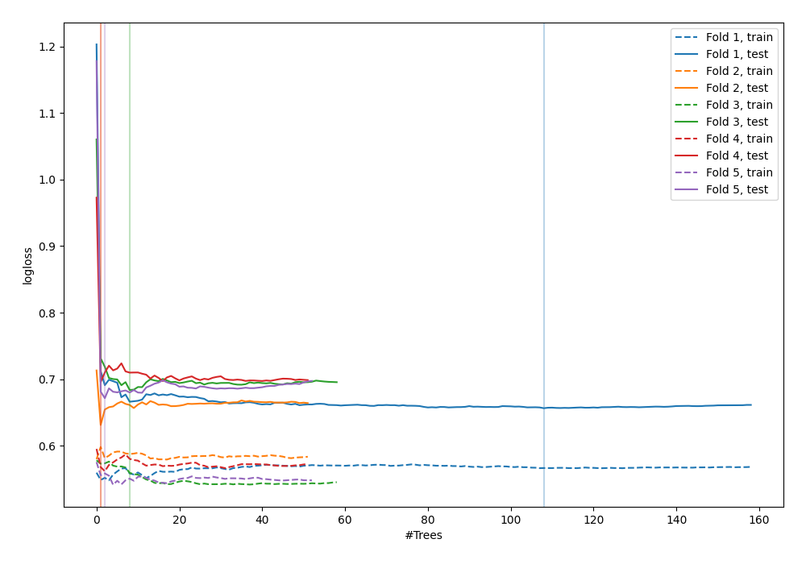

# Summary of 55_ExtraTrees

[<< Go back](../README.md)

## Extra Trees Classifier (Extra Trees)
- **n_jobs**: -1
- **criterion**: gini
- **max_features**: 0.6
- **min_samples_split**: 20
- **max_depth**: 4
- **explain_level**: 0

## Validation
 - **validation_type**: kfold
 - **shuffle**: True
 - **stratify**: True
 - **k_folds**: 5

## Optimized metric
logloss

## Training time

3.3 seconds

## Metric details
|           |    score |   threshold |
|:----------|---------:|------------:|
| logloss   | 0.667633 | nan         |
| auc       | 0.633799 | nan         |
| f1        | 0.661538 |   0.301418  |
| accuracy  | 0.614545 |   0.494046  |
| precision | 0.888889 |   0.691933  |
| recall    | 1        |   0.0642857 |
| mcc       | 0.229666 |   0.494046  |

## Confusion matrix (at threshold=0.494046)
|                     |   Predicted as negative |   Predicted as positive |
|:--------------------|------------------------:|------------------------:|
| Labeled as negative |                      85 |                      56 |
| Labeled as positive |                      50 |                      84 |

## Learning curves

[<< Go back](../README.md)
