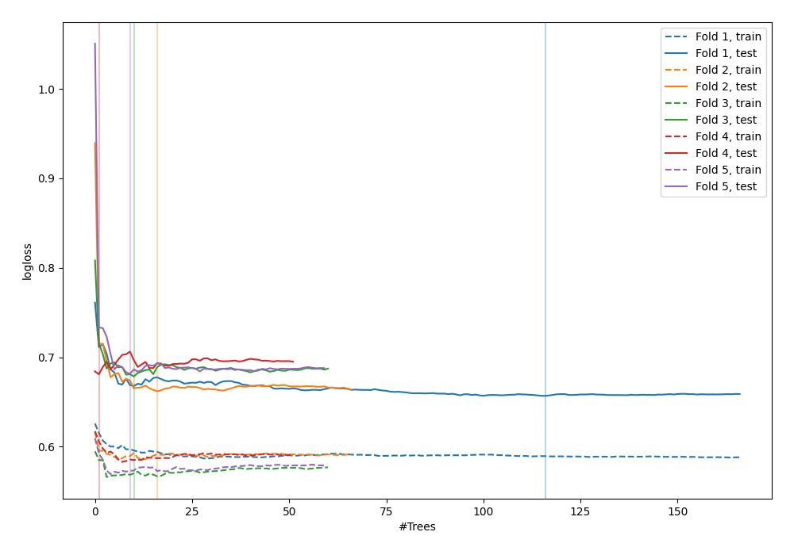

# Summary of 56_ExtraTrees

[<< Go back](../README.md)

## Extra Trees Classifier (Extra Trees)
- **n_jobs**: -1
- **criterion**: gini
- **max_features**: 0.5
- **min_samples_split**: 50
- **max_depth**: 5
- **explain_level**: 0

## Validation
 - **validation_type**: kfold
 - **shuffle**: True
 - **stratify**: True
 - **k_folds**: 5

## Optimized metric
logloss

## Training time

3.4 seconds

## Metric details
|           |    score |   threshold |
|:----------|---------:|------------:|
| logloss   | 0.671959 |  nan        |
| auc       | 0.62975  |  nan        |
| f1        | 0.67027  |    0.380794 |
| accuracy  | 0.603636 |    0.528899 |
| precision | 0.75     |    0.597898 |
| recall    | 1        |    0.169737 |
| mcc       | 0.210969 |    0.460546 |

## Confusion matrix (at threshold=0.528899)
|                     |   Predicted as negative |   Predicted as positive |
|:--------------------|------------------------:|------------------------:|
| Labeled as negative |                     107 |                      34 |
| Labeled as positive |                      75 |                      59 |

## Learning curves

[<< Go back](../README.md)
