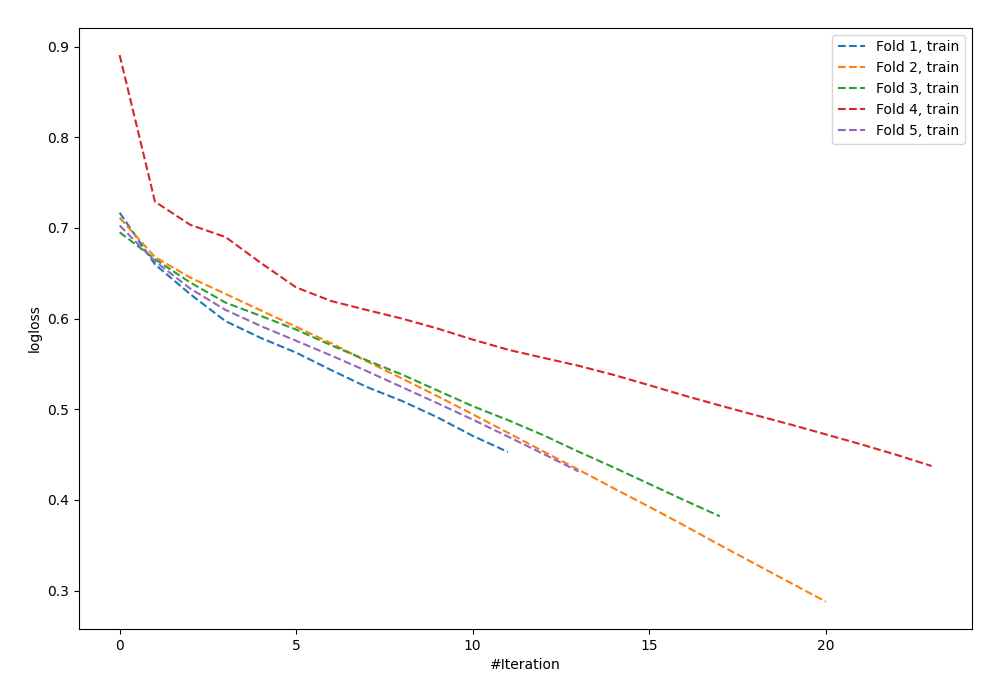

# Summary of 58_NeuralNetwork

[<< Go back](../README.md)

## Neural Network
- **n_jobs**: -1
- **dense_1_size**: 64
- **dense_2_size**: 16
- **learning_rate**: 0.01
- **explain_level**: 0

## Validation
 - **validation_type**: kfold
 - **shuffle**: True
 - **stratify**: True
 - **k_folds**: 5

## Optimized metric
logloss

## Training time

1.3 seconds

## Metric details
|           |    score |    threshold |
|:----------|---------:|-------------:|
| logloss   | 0.731949 | nan          |
| auc       | 0.556738 | nan          |
| f1        | 0.655257 |   0.00677283 |
| accuracy  | 0.56     |   0.500992   |
| precision | 0.666667 |   0.749272   |
| recall    | 1        |   0.00677283 |
| mcc       | 0.117455 |   0.500992   |

## Confusion matrix (at threshold=0.500992)
|                     |   Predicted as negative |   Predicted as positive |
|:--------------------|------------------------:|------------------------:|
| Labeled as negative |                      90 |                      51 |
| Labeled as positive |                      70 |                      64 |

## Learning curves

[<< Go back](../README.md)
