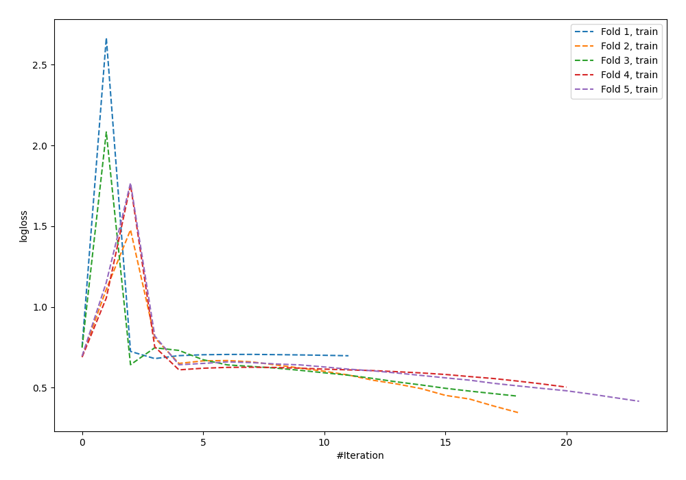

# Summary of 59_NeuralNetwork

[<< Go back](../README.md)

## Neural Network
- **n_jobs**: -1
- **dense_1_size**: 64
- **dense_2_size**: 32
- **learning_rate**: 0.08
- **explain_level**: 0

## Validation
 - **validation_type**: kfold
 - **shuffle**: True
 - **stratify**: True
 - **k_folds**: 5

## Optimized metric
logloss

## Training time

1.5 seconds

## Metric details
|           |    score |     threshold |
|:----------|---------:|--------------:|
| logloss   | 1.10652  | nan           |
| auc       | 0.543771 | nan           |
| f1        | 0.656863 |   4.67386e-05 |
| accuracy  | 0.563636 |   0.527898    |
| precision | 0.65     |   0.668067    |
| recall    | 1        |   3.43942e-13 |
| mcc       | 0.133549 |   0.527898    |

## Confusion matrix (at threshold=0.527898)
|                     |   Predicted as negative |   Predicted as positive |
|:--------------------|------------------------:|------------------------:|
| Labeled as negative |                     115 |                      26 |
| Labeled as positive |                      94 |                      40 |

## Learning curves

[<< Go back](../README.md)
