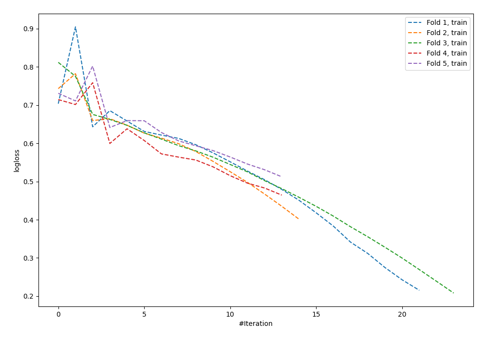

# Summary of 60_NeuralNetwork

[<< Go back](../README.md)

## Neural Network
- **n_jobs**: -1
- **dense_1_size**: 32
- **dense_2_size**: 32
- **learning_rate**: 0.05
- **explain_level**: 0

## Validation
 - **validation_type**: kfold
 - **shuffle**: True
 - **stratify**: True
 - **k_folds**: 5

## Optimized metric
logloss

## Training time

0.8 seconds

## Metric details
|           |     score |     threshold |
|:----------|----------:|--------------:|
| logloss   | 0.802872  | nan           |
| auc       | 0.524823  | nan           |
| f1        | 0.66      |   0.134662    |
| accuracy  | 0.545455  |   0.598151    |
| precision | 0.588235  |   0.603454    |
| recall    | 1         |   5.52816e-07 |
| mcc       | 0.0975393 |   0.134662    |

## Confusion matrix (at threshold=0.598151)
|                     |   Predicted as negative |   Predicted as positive |
|:--------------------|------------------------:|------------------------:|
| Labeled as negative |                     119 |                      22 |
| Labeled as positive |                     103 |                      31 |

## Learning curves

[<< Go back](../README.md)
