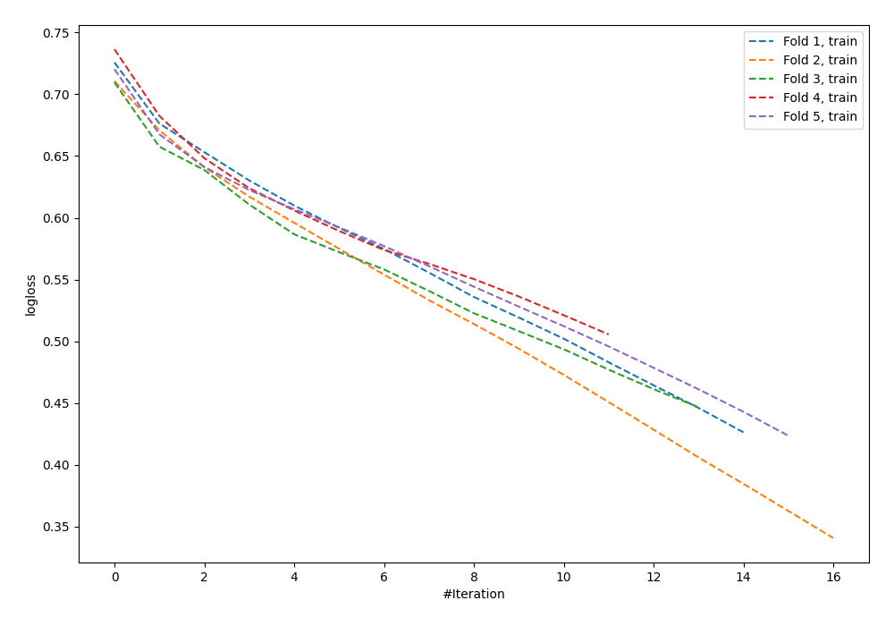

# Summary of 61_NeuralNetwork

[<< Go back](../README.md)

## Neural Network
- **n_jobs**: -1
- **dense_1_size**: 64
- **dense_2_size**: 16
- **learning_rate**: 0.01
- **explain_level**: 0

## Validation
 - **validation_type**: kfold
 - **shuffle**: True
 - **stratify**: True
 - **k_folds**: 5

## Optimized metric
logloss

## Training time

1.3 seconds

## Metric details
|           |    score |   threshold |
|:----------|---------:|------------:|
| logloss   | 0.693315 |  nan        |
| auc       | 0.565629 |  nan        |
| f1        | 0.66005  |    0.236721 |
| accuracy  | 0.552727 |    0.55911  |
| precision | 0.8      |    0.752708 |
| recall    | 1        |    0.109165 |
| mcc       | 0.138285 |    0.680539 |

## Confusion matrix (at threshold=0.55911)
|                     |   Predicted as negative |   Predicted as positive |
|:--------------------|------------------------:|------------------------:|
| Labeled as negative |                     108 |                      33 |
| Labeled as positive |                      90 |                      44 |

## Learning curves

[<< Go back](../README.md)
