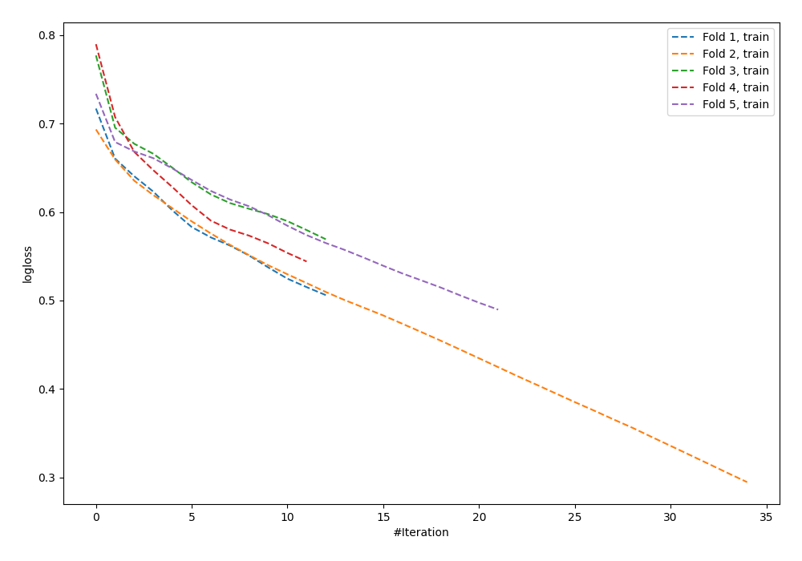

# Summary of 61_NeuralNetwork_SelectedFeatures

[<< Go back](../README.md)

## Neural Network
- **n_jobs**: -1
- **dense_1_size**: 64
- **dense_2_size**: 16
- **learning_rate**: 0.01
- **explain_level**: 0

## Validation
 - **validation_type**: kfold
 - **shuffle**: True
 - **stratify**: True
 - **k_folds**: 5

## Optimized metric
logloss

## Training time

1.8 seconds

## Metric details
|           |    score |    threshold |
|:----------|---------:|-------------:|
| logloss   | 0.689637 | nan          |
| auc       | 0.596221 | nan          |
| f1        | 0.666667 |   0.25964    |
| accuracy  | 0.6      |   0.536127   |
| precision | 0.725    |   0.611779   |
| recall    | 1        |   0.00122763 |
| mcc       | 0.219417 |   0.562614   |

## Confusion matrix (at threshold=0.536127)
|                     |   Predicted as negative |   Predicted as positive |
|:--------------------|------------------------:|------------------------:|
| Labeled as negative |                     117 |                      24 |
| Labeled as positive |                      86 |                      48 |

## Learning curves

[<< Go back](../README.md)
