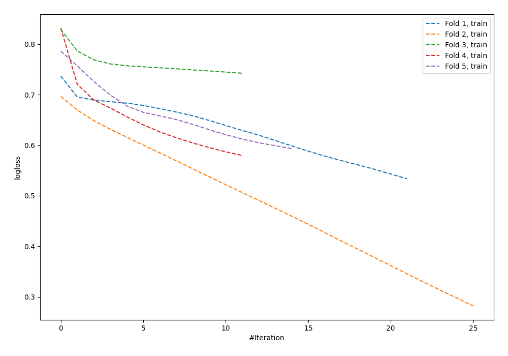

# Summary of 62_NeuralNetwork

[<< Go back](../README.md)

## Neural Network
- **n_jobs**: -1
- **dense_1_size**: 64
- **dense_2_size**: 4
- **learning_rate**: 0.01
- **explain_level**: 0

## Validation
 - **validation_type**: kfold
 - **shuffle**: True
 - **stratify**: True
 - **k_folds**: 5

## Optimized metric
logloss

## Training time

1.3 seconds

## Metric details
|           |    score |   threshold |
|:----------|---------:|------------:|
| logloss   | 0.713433 | nan         |
| auc       | 0.575368 | nan         |
| f1        | 0.664975 |   0.251728  |
| accuracy  | 0.574545 |   0.443815  |
| precision | 0.64     |   0.702326  |
| recall    | 1        |   0.0661019 |
| mcc       | 0.148701 |   0.443815  |

## Confusion matrix (at threshold=0.443815)
|                     |   Predicted as negative |   Predicted as positive |
|:--------------------|------------------------:|------------------------:|
| Labeled as negative |                      82 |                      59 |
| Labeled as positive |                      58 |                      76 |

## Learning curves

[<< Go back](../README.md)
