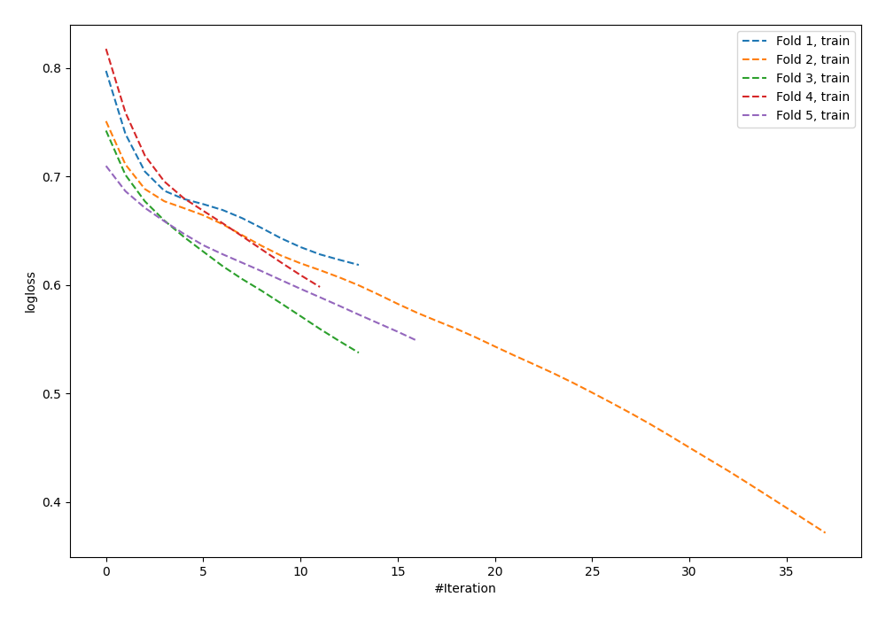

# Summary of 63_NeuralNetwork

[<< Go back](../README.md)

## Neural Network
- **n_jobs**: -1
- **dense_1_size**: 16
- **dense_2_size**: 16
- **learning_rate**: 0.01
- **explain_level**: 0

## Validation
 - **validation_type**: kfold
 - **shuffle**: True
 - **stratify**: True
 - **k_folds**: 5

## Optimized metric
logloss

## Training time

0.8 seconds

## Metric details
|           |    score |   threshold |
|:----------|---------:|------------:|
| logloss   | 0.714506 | nan         |
| auc       | 0.529586 | nan         |
| f1        | 0.65995  |   0.223439  |
| accuracy  | 0.541818 |   0.569667  |
| precision | 0.705882 |   0.696272  |
| recall    | 1        |   0.0553631 |
| mcc       | 0.112268 |   0.696272  |

## Confusion matrix (at threshold=0.569667)
|                     |   Predicted as negative |   Predicted as positive |
|:--------------------|------------------------:|------------------------:|
| Labeled as negative |                     113 |                      28 |
| Labeled as positive |                      98 |                      36 |

## Learning curves

[<< Go back](../README.md)
