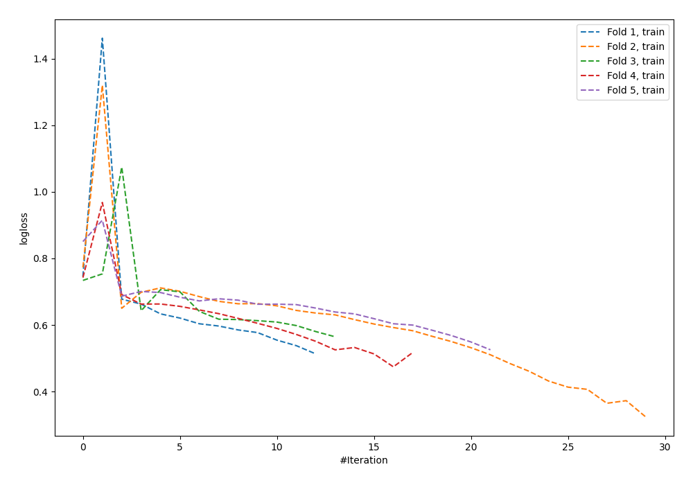

# Summary of 64_NeuralNetwork

[<< Go back](../README.md)

## Neural Network
- **n_jobs**: -1
- **dense_1_size**: 64
- **dense_2_size**: 8
- **learning_rate**: 0.1
- **explain_level**: 0

## Validation
 - **validation_type**: kfold
 - **shuffle**: True
 - **stratify**: True
 - **k_folds**: 5

## Optimized metric
logloss

## Training time

1.4 seconds

## Metric details
|           |    score |   threshold |
|:----------|---------:|------------:|
| logloss   | 0.701443 | nan         |
| auc       | 0.584471 | nan         |
| f1        | 0.66     |   0.177342  |
| accuracy  | 0.585455 |   0.536957  |
| precision | 0.666667 |   0.773006  |
| recall    | 1        |   0.0154012 |
| mcc       | 0.16988  |   0.536957  |

## Confusion matrix (at threshold=0.536957)
|                     |   Predicted as negative |   Predicted as positive |
|:--------------------|------------------------:|------------------------:|
| Labeled as negative |                      99 |                      42 |
| Labeled as positive |                      72 |                      62 |

## Learning curves

[<< Go back](../README.md)
