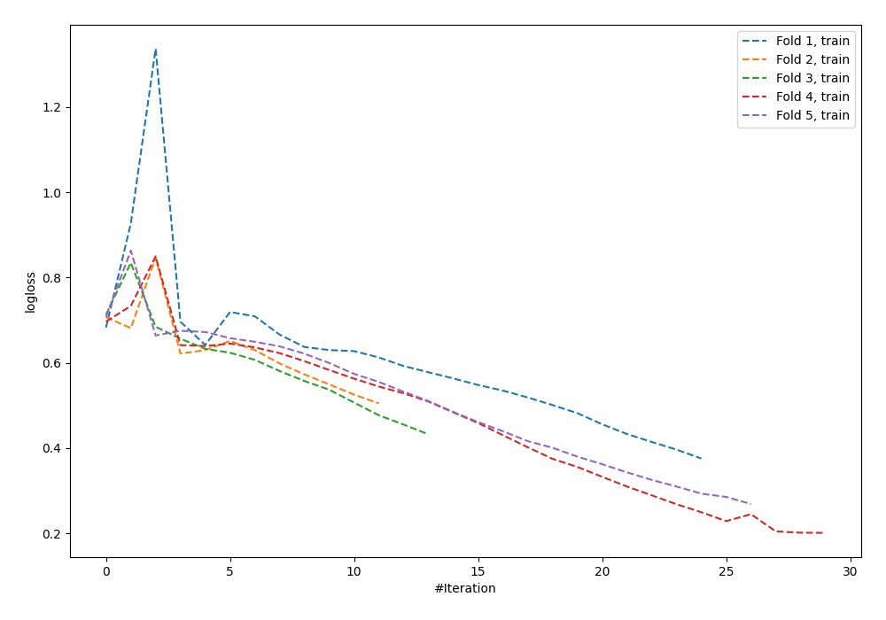

# Summary of 65_NeuralNetwork

[<< Go back](../README.md)

## Neural Network
- **n_jobs**: -1
- **dense_1_size**: 16
- **dense_2_size**: 32
- **learning_rate**: 0.08
- **explain_level**: 0

## Validation
 - **validation_type**: kfold
 - **shuffle**: True
 - **stratify**: True
 - **k_folds**: 5

## Optimized metric
logloss

## Training time

0.8 seconds

## Metric details
|           |    score |    threshold |
|:----------|---------:|-------------:|
| logloss   | 0.921556 | nan          |
| auc       | 0.530989 | nan          |
| f1        | 0.660099 |   0.00914537 |
| accuracy  | 0.538182 |   0.620777   |
| precision | 0.560976 |   0.74671    |
| recall    | 1        |   5.6246e-06 |
| mcc       | 0.102381 |   0.00914537 |

## Confusion matrix (at threshold=0.620777)
|                     |   Predicted as negative |   Predicted as positive |
|:--------------------|------------------------:|------------------------:|
| Labeled as negative |                     107 |                      34 |
| Labeled as positive |                      93 |                      41 |

## Learning curves

[<< Go back](../README.md)
