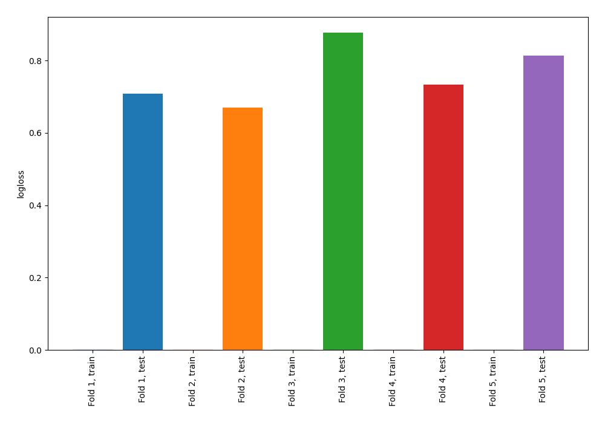

# Summary of 68_NearestNeighbors

[<< Go back](../README.md)

## k-Nearest Neighbors (Nearest Neighbors)
- **n_jobs**: -1
- **n_neighbors**: 7
- **weights**: distance
- **explain_level**: 0

## Validation
 - **validation_type**: kfold
 - **shuffle**: True
 - **stratify**: True
 - **k_folds**: 5

## Optimized metric
logloss

## Training time

0.7 seconds

## Metric details
|           |    score |   threshold |
|:----------|---------:|------------:|
| logloss   | 0.760141 | nan         |
| auc       | 0.539007 | nan         |
| f1        | 0.655257 |   0.0998451 |
| accuracy  | 0.549091 |   0.39142   |
| precision | 0.6      |   0.73465   |
| recall    | 1        |   0.0998451 |
| mcc       | 0.117969 |   0.39142   |

## Confusion matrix (at threshold=0.39142)
|                     |   Predicted as negative |   Predicted as positive |
|:--------------------|------------------------:|------------------------:|
| Labeled as negative |                      50 |                      91 |
| Labeled as positive |                      33 |                     101 |

## Learning curves

[<< Go back](../README.md)
