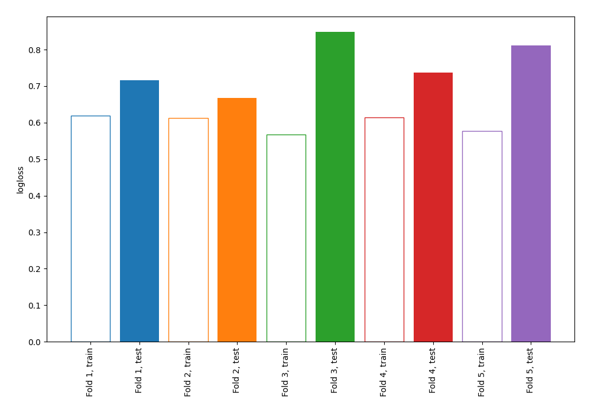

# Summary of 71_NearestNeighbors

[<< Go back](../README.md)

## k-Nearest Neighbors (Nearest Neighbors)
- **n_jobs**: -1
- **n_neighbors**: 7
- **weights**: uniform
- **explain_level**: 0

## Validation
 - **validation_type**: kfold
 - **shuffle**: True
 - **stratify**: True
 - **k_folds**: 5

## Optimized metric
logloss

## Training time

1.2 seconds

## Metric details
|           |     score |   threshold |
|:----------|----------:|------------:|
| logloss   | 0.755946  |  nan        |
| auc       | 0.53337   |  nan        |
| f1        | 0.655257  |    0.128571 |
| accuracy  | 0.530909  |    0.357143 |
| precision | 1         |    0.857143 |
| recall    | 1         |    0.128571 |
| mcc       | 0.0829758 |    0.357143 |

## Confusion matrix (at threshold=0.357143)
|                     |   Predicted as negative |   Predicted as positive |
|:--------------------|------------------------:|------------------------:|
| Labeled as negative |                      43 |                      98 |
| Labeled as positive |                      31 |                     103 |

## Learning curves

[<< Go back](../README.md)
