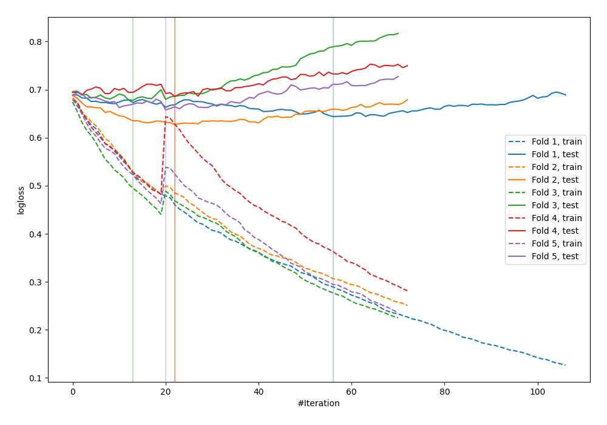

# Summary of 73_CatBoost

[<< Go back](../README.md)

## CatBoost
- **n_jobs**: -1
- **learning_rate**: 0.1
- **depth**: 5
- **rsm**: 0.7
- **loss_function**: Logloss
- **explain_level**: 0

## Validation
 - **validation_type**: kfold
 - **shuffle**: True
 - **stratify**: True
 - **k_folds**: 5

## Optimized metric
logloss

## Training time

1.9 seconds

## Metric details
|           |    score |   threshold |
|:----------|---------:|------------:|
| logloss   | 0.658898 |  nan        |
| auc       | 0.664999 |  nan        |
| f1        | 0.68306  |    0.361973 |
| accuracy  | 0.647273 |    0.486121 |
| precision | 0.689189 |    0.552948 |
| recall    | 1        |    0.157331 |
| mcc       | 0.293965 |    0.484701 |

## Confusion matrix (at threshold=0.486121)
|                     |   Predicted as negative |   Predicted as positive |
|:--------------------|------------------------:|------------------------:|
| Labeled as negative |                      95 |                      46 |
| Labeled as positive |                      51 |                      83 |

## Learning curves

[<< Go back](../README.md)
