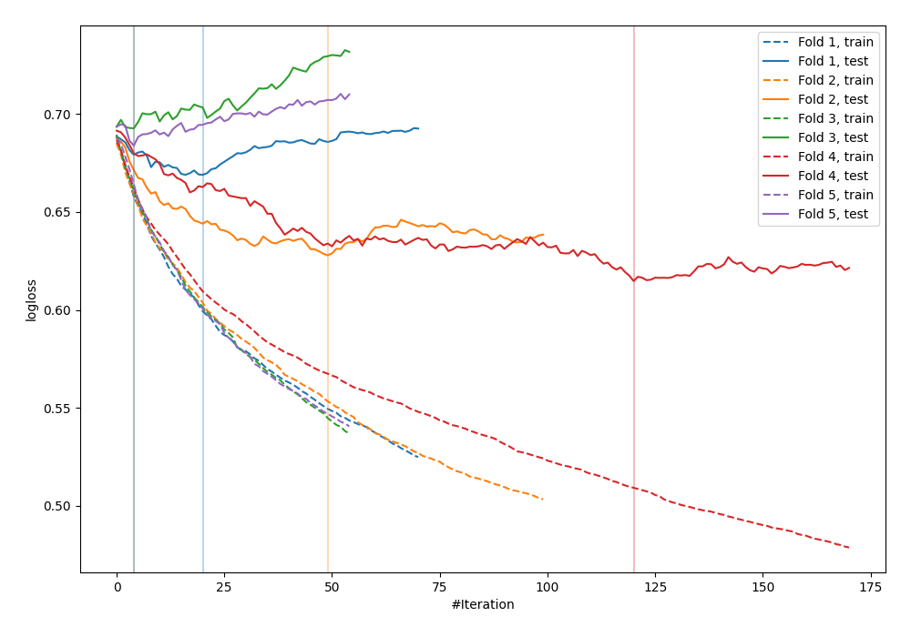

# Summary of 74_Xgboost_SelectedFeatures

[<< Go back](../README.md)

## Extreme Gradient Boosting (Xgboost)
- **n_jobs**: -1
- **objective**: binary:logistic
- **eval_metric**: logloss
- **eta**: 0.075
- **max_depth**: 8
- **min_child_weight**: 10
- **subsample**: 0.9
- **colsample_bytree**: 0.7
- **explain_level**: 0

## Validation
 - **validation_type**: kfold
 - **shuffle**: True
 - **stratify**: True
 - **k_folds**: 5

## Optimized metric
logloss

## Training time

0.9 seconds

## Metric details
|           |    score |   threshold |
|:----------|---------:|------------:|
| logloss   | 0.657656 |  nan        |
| auc       | 0.640971 |  nan        |
| f1        | 0.670157 |    0.330882 |
| accuracy  | 0.614545 |    0.476545 |
| precision | 0.814815 |    0.650475 |
| recall    | 1        |    0.152348 |
| mcc       | 0.240812 |    0.471407 |

## Confusion matrix (at threshold=0.476545)
|                     |   Predicted as negative |   Predicted as positive |
|:--------------------|------------------------:|------------------------:|
| Labeled as negative |                      78 |                      63 |
| Labeled as positive |                      43 |                      91 |

## Learning curves

[<< Go back](../README.md)
