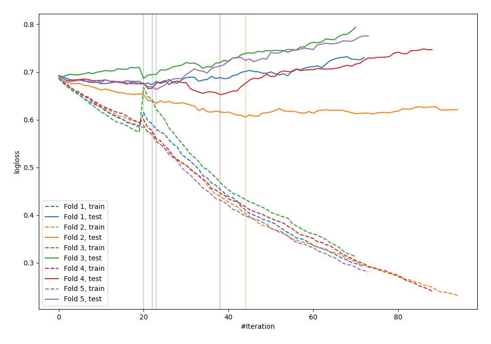

# Summary of 75_CatBoost_SelectedFeatures

[<< Go back](../README.md)

## CatBoost
- **n_jobs**: -1
- **learning_rate**: 0.1
- **depth**: 5
- **rsm**: 0.7
- **loss_function**: Logloss
- **explain_level**: 0

## Validation
 - **validation_type**: kfold
 - **shuffle**: True
 - **stratify**: True
 - **k_folds**: 5

## Optimized metric
logloss

## Training time

1.1 seconds

## Metric details
|           |    score |   threshold |
|:----------|---------:|------------:|
| logloss   | 0.65629  |  nan        |
| auc       | 0.66058  |  nan        |
| f1        | 0.674699 |    0.432253 |
| accuracy  | 0.629091 |    0.490941 |
| precision | 1        |    0.801863 |
| recall    | 1        |    0.100231 |
| mcc       | 0.260337 |    0.490941 |

## Confusion matrix (at threshold=0.490941)
|                     |   Predicted as negative |   Predicted as positive |
|:--------------------|------------------------:|------------------------:|
| Labeled as negative |                      84 |                      57 |
| Labeled as positive |                      45 |                      89 |

## Learning curves

[<< Go back](../README.md)
