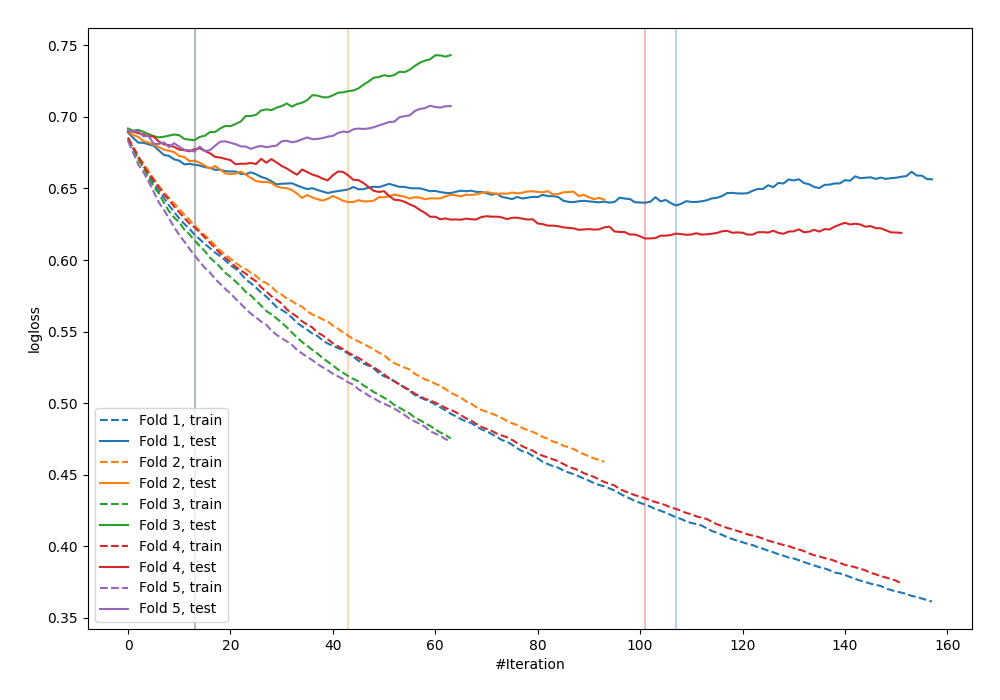

# Summary of 76_LightGBM_SelectedFeatures

[<< Go back](../README.md)

## LightGBM
- **n_jobs**: -1
- **objective**: binary
- **metric**: binary_logloss
- **num_leaves**: 63
- **learning_rate**: 0.05
- **feature_fraction**: 0.9
- **bagging_fraction**: 0.5
- **min_data_in_leaf**: 30
- **explain_level**: 0

## Validation
 - **validation_type**: kfold
 - **shuffle**: True
 - **stratify**: True
 - **k_folds**: 5

## Optimized metric
logloss

## Training time

0.8 seconds

## Metric details
|           |    score |   threshold |
|:----------|---------:|------------:|
| logloss   | 0.650619 | nan         |
| auc       | 0.667461 | nan         |
| f1        | 0.675676 |   0.308757  |
| accuracy  | 0.632727 |   0.483275  |
| precision | 0.787879 |   0.671817  |
| recall    | 1        |   0.0905995 |
| mcc       | 0.26545  |   0.483275  |

## Confusion matrix (at threshold=0.483275)
|                     |   Predicted as negative |   Predicted as positive |
|:--------------------|------------------------:|------------------------:|
| Labeled as negative |                      89 |                      52 |
| Labeled as positive |                      49 |                      85 |

## Learning curves

[<< Go back](../README.md)
