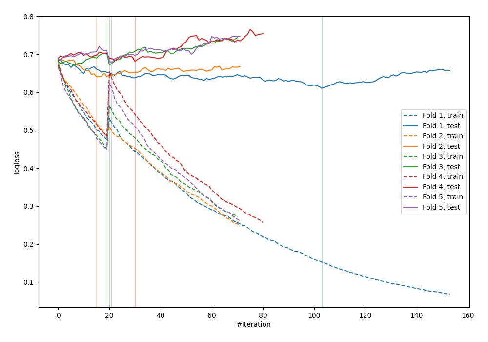

# Summary of 78_CatBoost_GoldenFeatures

[<< Go back](../README.md)

## CatBoost
- **n_jobs**: -1
- **learning_rate**: 0.1
- **depth**: 5
- **rsm**: 0.7
- **loss_function**: Logloss
- **explain_level**: 0

## Validation
 - **validation_type**: kfold
 - **shuffle**: True
 - **stratify**: True
 - **k_folds**: 5

## Optimized metric
logloss

## Training time

2.8 seconds

## Metric details
|           |    score |   threshold |
|:----------|---------:|------------:|
| logloss   | 0.656867 | nan         |
| auc       | 0.650445 | nan         |
| f1        | 0.677507 |   0.369795  |
| accuracy  | 0.614545 |   0.536735  |
| precision | 0.857143 |   0.783018  |
| recall    | 1        |   0.0815064 |
| mcc       | 0.244554 |   0.42991   |

## Confusion matrix (at threshold=0.536735)
|                     |   Predicted as negative |   Predicted as positive |
|:--------------------|------------------------:|------------------------:|
| Labeled as negative |                     106 |                      35 |
| Labeled as positive |                      71 |                      63 |

## Learning curves

[<< Go back](../README.md)
