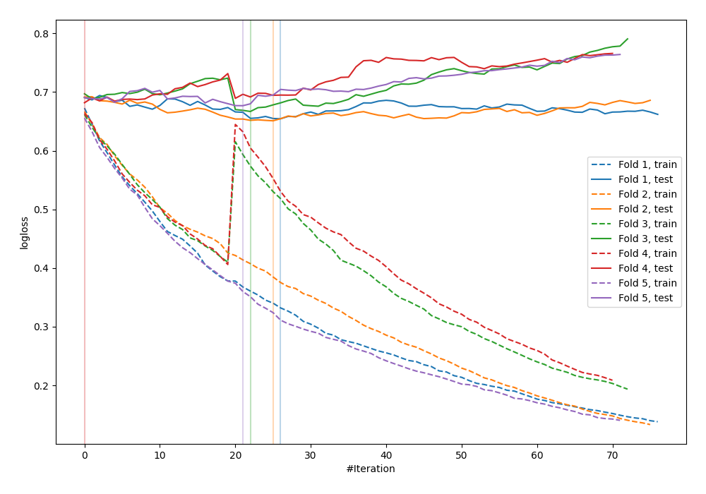

# Summary of 7_Default_CatBoost

[<< Go back](../README.md)

## CatBoost
- **n_jobs**: -1
- **learning_rate**: 0.1
- **depth**: 6
- **rsm**: 1
- **loss_function**: Logloss
- **explain_level**: 0

## Validation
 - **validation_type**: kfold
 - **shuffle**: True
 - **stratify**: True
 - **k_folds**: 5

## Optimized metric
logloss

## Training time

2.4 seconds

## Metric details
|           |    score |   threshold |
|:----------|---------:|------------:|
| logloss   | 0.667725 |  nan        |
| auc       | 0.635281 |  nan        |
| f1        | 0.659574 |    0.344074 |
| accuracy  | 0.625455 |    0.525012 |
| precision | 0.909091 |    0.719862 |
| recall    | 1        |    0.117037 |
| mcc       | 0.252685 |    0.525012 |

## Confusion matrix (at threshold=0.525012)
|                     |   Predicted as negative |   Predicted as positive |
|:--------------------|------------------------:|------------------------:|
| Labeled as negative |                     105 |                      36 |
| Labeled as positive |                      67 |                      67 |

## Learning curves

[<< Go back](../README.md)
