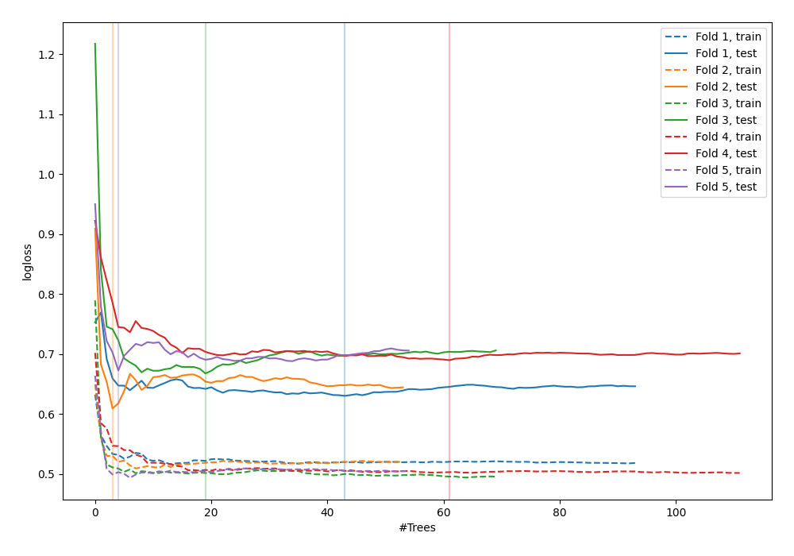

# Summary of 80_RandomForest_GoldenFeatures

[<< Go back](../README.md)

## Random Forest
- **n_jobs**: -1
- **criterion**: gini
- **max_features**: 0.9
- **min_samples_split**: 40
- **max_depth**: 7
- **explain_level**: 0

## Validation
 - **validation_type**: kfold
 - **shuffle**: True
 - **stratify**: True
 - **k_folds**: 5

## Optimized metric
logloss

## Training time

3.6 seconds

## Metric details
|           |    score |   threshold |
|:----------|---------:|------------:|
| logloss   | 0.654139 |  nan        |
| auc       | 0.66185  |  nan        |
| f1        | 0.676829 |    0.391124 |
| accuracy  | 0.629091 |    0.563795 |
| precision | 1        |    0.813437 |
| recall    | 1        |    0.110588 |
| mcc       | 0.265835 |    0.563795 |

## Confusion matrix (at threshold=0.563795)
|                     |   Predicted as negative |   Predicted as positive |
|:--------------------|------------------------:|------------------------:|
| Labeled as negative |                     112 |                      29 |
| Labeled as positive |                      73 |                      61 |

## Learning curves

[<< Go back](../README.md)
