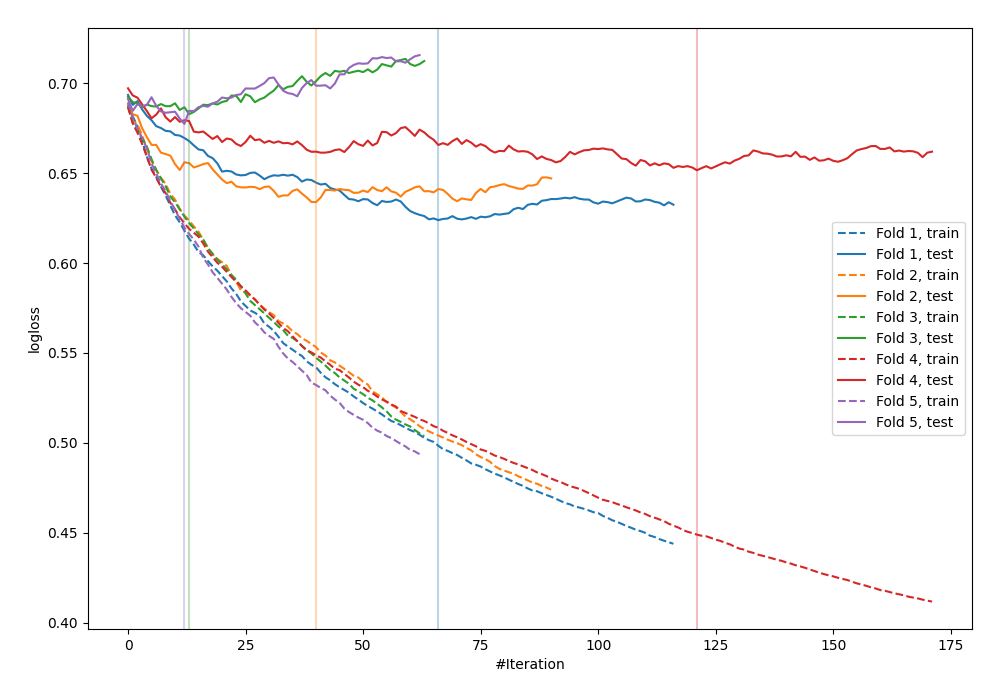

# Summary of 81_Xgboost

[<< Go back](../README.md)

## Extreme Gradient Boosting (Xgboost)
- **n_jobs**: -1
- **objective**: binary:logistic
- **eval_metric**: logloss
- **eta**: 0.075
- **max_depth**: 8
- **min_child_weight**: 10
- **subsample**: 0.9
- **colsample_bytree**: 0.7
- **explain_level**: 0

## Validation
 - **validation_type**: kfold
 - **shuffle**: True
 - **stratify**: True
 - **k_folds**: 5

## Optimized metric
logloss

## Training time

0.9 seconds

## Metric details
|           |    score |   threshold |
|:----------|---------:|------------:|
| logloss   | 0.65393  |  nan        |
| auc       | 0.652985 |  nan        |
| f1        | 0.664921 |    0.304041 |
| accuracy  | 0.618182 |    0.480281 |
| precision | 0.866667 |    0.695745 |
| recall    | 1        |    0.127967 |
| mcc       | 0.244704 |    0.443504 |

## Confusion matrix (at threshold=0.480281)
|                     |   Predicted as negative |   Predicted as positive |
|:--------------------|------------------------:|------------------------:|
| Labeled as negative |                      87 |                      54 |
| Labeled as positive |                      51 |                      83 |

## Learning curves

[<< Go back](../README.md)
