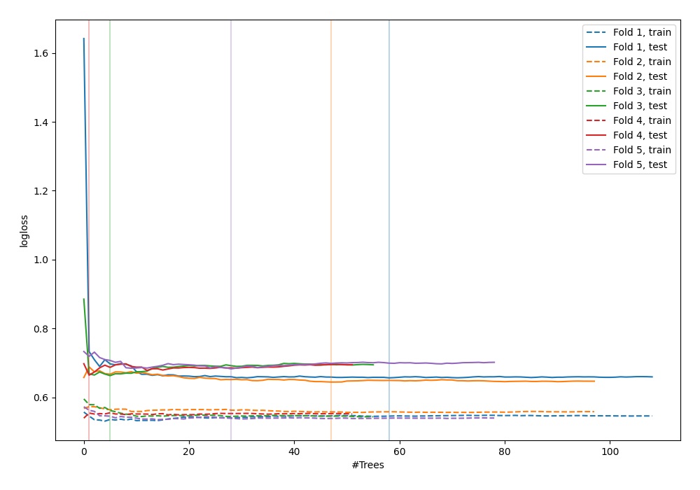

# Summary of 82_ExtraTrees_SelectedFeatures

[<< Go back](../README.md)

## Extra Trees Classifier (Extra Trees)
- **n_jobs**: -1
- **criterion**: gini
- **max_features**: 0.9
- **min_samples_split**: 40
- **max_depth**: 7
- **explain_level**: 0

## Validation
 - **validation_type**: kfold
 - **shuffle**: True
 - **stratify**: True
 - **k_folds**: 5

## Optimized metric
logloss

## Training time

3.2 seconds

## Metric details
|           |    score |   threshold |
|:----------|---------:|------------:|
| logloss   | 0.66216  |  nan        |
| auc       | 0.642479 |  nan        |
| f1        | 0.675063 |    0.229245 |
| accuracy  | 0.629091 |    0.464782 |
| precision | 0.75     |    0.716795 |
| recall    | 1        |    0.109694 |
| mcc       | 0.264093 |    0.464782 |

## Confusion matrix (at threshold=0.464782)
|                     |   Predicted as negative |   Predicted as positive |
|:--------------------|------------------------:|------------------------:|
| Labeled as negative |                      79 |                      62 |
| Labeled as positive |                      40 |                      94 |

## Learning curves

[<< Go back](../README.md)
