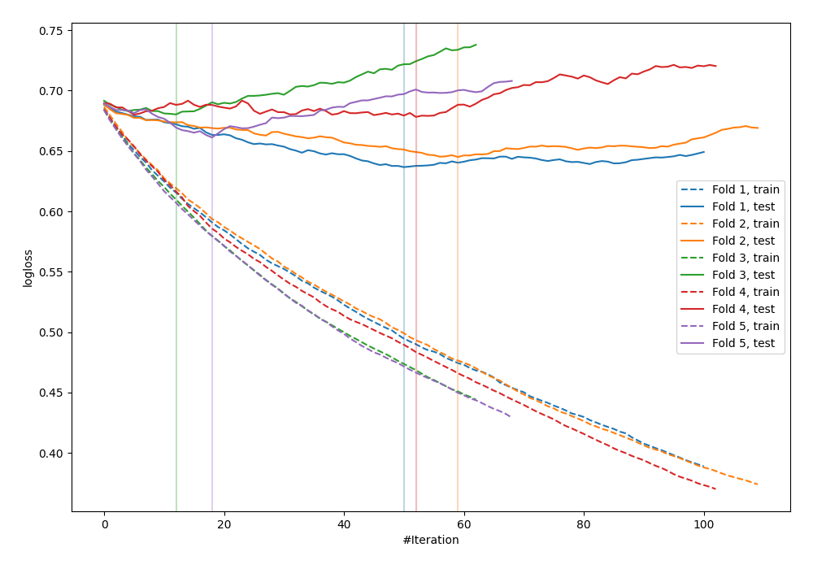

# Summary of 83_LightGBM

[<< Go back](../README.md)

## LightGBM
- **n_jobs**: -1
- **objective**: binary
- **metric**: binary_logloss
- **num_leaves**: 63
- **learning_rate**: 0.05
- **feature_fraction**: 0.9
- **bagging_fraction**: 0.5
- **min_data_in_leaf**: 30
- **explain_level**: 0

## Validation
 - **validation_type**: kfold
 - **shuffle**: True
 - **stratify**: True
 - **k_folds**: 5

## Optimized metric
logloss

## Training time

0.8 seconds

## Metric details
|           |    score |   threshold |
|:----------|---------:|------------:|
| logloss   | 0.660277 |  nan        |
| auc       | 0.647481 |  nan        |
| f1        | 0.67033  |    0.366061 |
| accuracy  | 0.625455 |    0.497179 |
| precision | 0.785714 |    0.717462 |
| recall    | 1        |    0.160308 |
| mcc       | 0.249836 |    0.497179 |

## Confusion matrix (at threshold=0.497179)
|                     |   Predicted as negative |   Predicted as positive |
|:--------------------|------------------------:|------------------------:|
| Labeled as negative |                      97 |                      44 |
| Labeled as positive |                      59 |                      75 |

## Learning curves

[<< Go back](../README.md)
