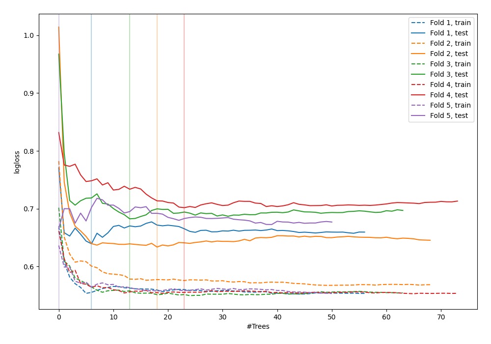

# Summary of 89_RandomForest

[<< Go back](../README.md)

## Random Forest
- **n_jobs**: -1
- **criterion**: gini
- **max_features**: 0.9
- **min_samples_split**: 40
- **max_depth**: 3
- **explain_level**: 0

## Validation
 - **validation_type**: kfold
 - **shuffle**: True
 - **stratify**: True
 - **k_folds**: 5

## Optimized metric
logloss

## Training time

2.9 seconds

## Metric details
|           |    score |   threshold |
|:----------|---------:|------------:|
| logloss   | 0.664629 | nan         |
| auc       | 0.643802 | nan         |
| f1        | 0.670185 |   0.338758  |
| accuracy  | 0.607273 |   0.442261  |
| precision | 0.761905 |   0.711584  |
| recall    | 1        |   0.0710526 |
| mcc       | 0.233941 |   0.442261  |

## Confusion matrix (at threshold=0.442261)
|                     |   Predicted as negative |   Predicted as positive |
|:--------------------|------------------------:|------------------------:|
| Labeled as negative |                      64 |                      77 |
| Labeled as positive |                      31 |                     103 |

## Learning curves

[<< Go back](../README.md)
