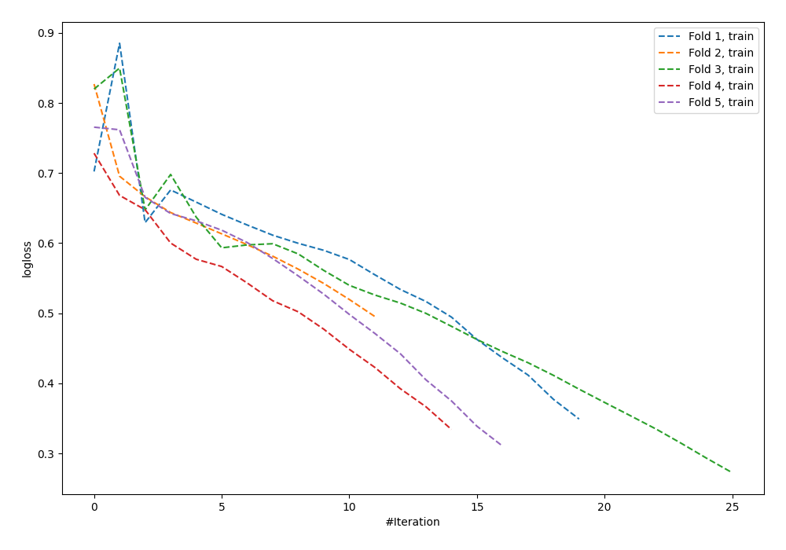

# Summary of 8_Default_NeuralNetwork

[<< Go back](../README.md)

## Neural Network
- **n_jobs**: -1
- **dense_1_size**: 32
- **dense_2_size**: 16
- **learning_rate**: 0.05
- **explain_level**: 0

## Validation
 - **validation_type**: kfold
 - **shuffle**: True
 - **stratify**: True
 - **k_folds**: 5

## Optimized metric
logloss

## Training time

0.8 seconds

## Metric details
|           |    score |     threshold |
|:----------|---------:|--------------:|
| logloss   | 0.75232  | nan           |
| auc       | 0.565259 | nan           |
| f1        | 0.655257 |   8.30738e-05 |
| accuracy  | 0.567273 |   0.563787    |
| precision | 0.608696 |   0.596131    |
| recall    | 1        |   8.30738e-05 |
| mcc       | 0.140593 |   0.596131    |

## Confusion matrix (at threshold=0.563787)
|                     |   Predicted as negative |   Predicted as positive |
|:--------------------|------------------------:|------------------------:|
| Labeled as negative |                     104 |                      37 |
| Labeled as positive |                      82 |                      52 |

## Learning curves

[<< Go back](../README.md)
