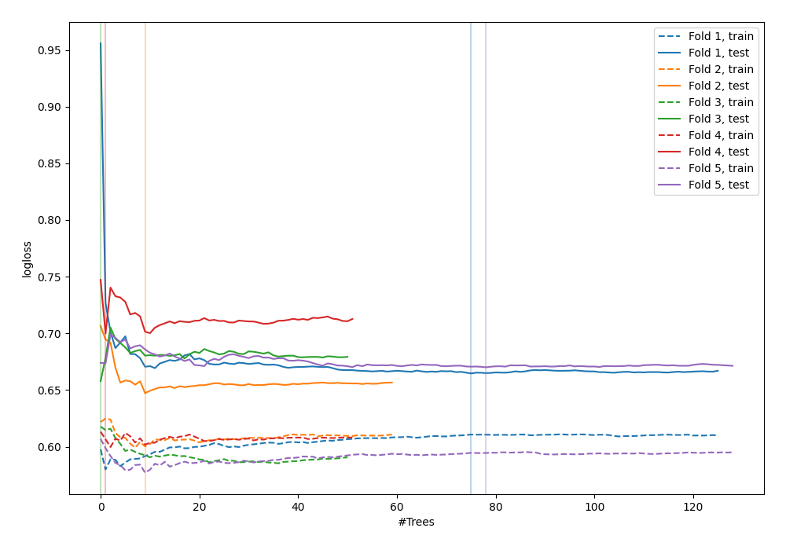

# Summary of 91_ExtraTrees

[<< Go back](../README.md)

## Extra Trees Classifier (Extra Trees)
- **n_jobs**: -1
- **criterion**: gini
- **max_features**: 0.9
- **min_samples_split**: 40
- **max_depth**: 3
- **explain_level**: 0

## Validation
 - **validation_type**: kfold
 - **shuffle**: True
 - **stratify**: True
 - **k_folds**: 5

## Optimized metric
logloss

## Training time

3.5 seconds

## Metric details
|           |    score |   threshold |
|:----------|---------:|------------:|
| logloss   | 0.667908 | nan         |
| auc       | 0.642744 | nan         |
| f1        | 0.6703   |   0.373495  |
| accuracy  | 0.621818 |   0.524385  |
| precision | 0.8125   |   0.632145  |
| recall    | 1        |   0.0409091 |
| mcc       | 0.244891 |   0.524385  |

## Confusion matrix (at threshold=0.524385)
|                     |   Predicted as negative |   Predicted as positive |
|:--------------------|------------------------:|------------------------:|
| Labeled as negative |                     104 |                      37 |
| Labeled as positive |                      67 |                      67 |

## Learning curves

[<< Go back](../README.md)
