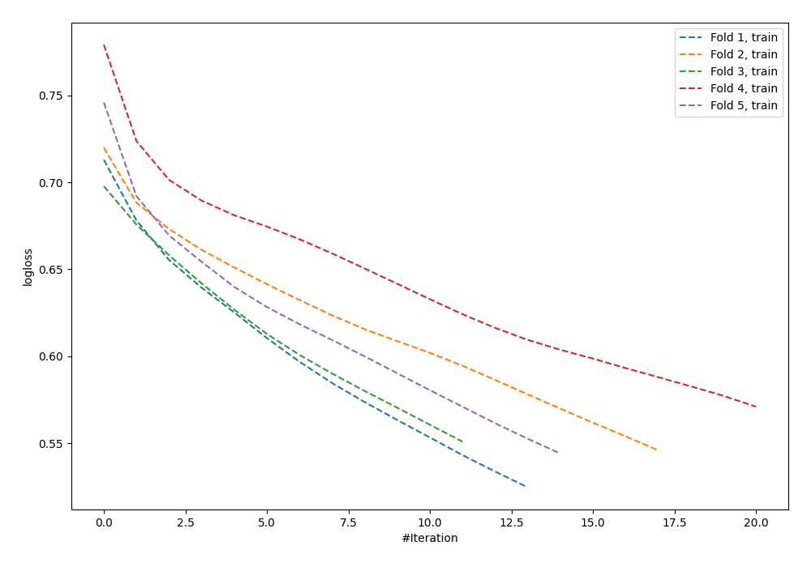

# Summary of 92_NeuralNetwork_SelectedFeatures

[<< Go back](../README.md)

## Neural Network
- **n_jobs**: -1
- **dense_1_size**: 64
- **dense_2_size**: 8
- **learning_rate**: 0.01
- **explain_level**: 0

## Validation
 - **validation_type**: kfold
 - **shuffle**: True
 - **stratify**: True
 - **k_folds**: 5

## Optimized metric
logloss

## Training time

0.8 seconds

## Metric details
|           |    score |   threshold |
|:----------|---------:|------------:|
| logloss   | 0.670033 |  nan        |
| auc       | 0.618265 |  nan        |
| f1        | 0.660099 |    0.279333 |
| accuracy  | 0.603636 |    0.50245  |
| precision | 0.8      |    0.701734 |
| recall    | 1        |    0.048091 |
| mcc       | 0.207592 |    0.50245  |

## Confusion matrix (at threshold=0.50245)
|                     |   Predicted as negative |   Predicted as positive |
|:--------------------|------------------------:|------------------------:|
| Labeled as negative |                     102 |                      39 |
| Labeled as positive |                      70 |                      64 |

## Learning curves

[<< Go back](../README.md)
