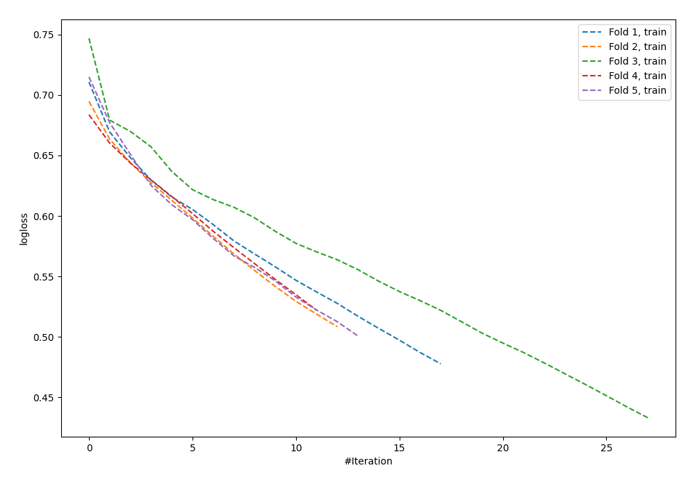

# Summary of 93_NeuralNetwork_SelectedFeatures

[<< Go back](../README.md)

## Neural Network
- **n_jobs**: -1
- **dense_1_size**: 64
- **dense_2_size**: 32
- **learning_rate**: 0.01
- **explain_level**: 0

## Validation
 - **validation_type**: kfold
 - **shuffle**: True
 - **stratify**: True
 - **k_folds**: 5

## Optimized metric
logloss

## Training time

1.7 seconds

## Metric details
|           |    score |     threshold |
|:----------|---------:|--------------:|
| logloss   | 0.695508 | nan           |
| auc       | 0.605483 | nan           |
| f1        | 0.674556 |   0.400253    |
| accuracy  | 0.6      |   0.400253    |
| precision | 0.604938 |   0.541437    |
| recall    | 1        |   0.000695238 |
| mcc       | 0.242645 |   0.400253    |

## Confusion matrix (at threshold=0.400253)
|                     |   Predicted as negative |   Predicted as positive |
|:--------------------|------------------------:|------------------------:|
| Labeled as negative |                      51 |                      90 |
| Labeled as positive |                      20 |                     114 |

## Learning curves

[<< Go back](../README.md)
