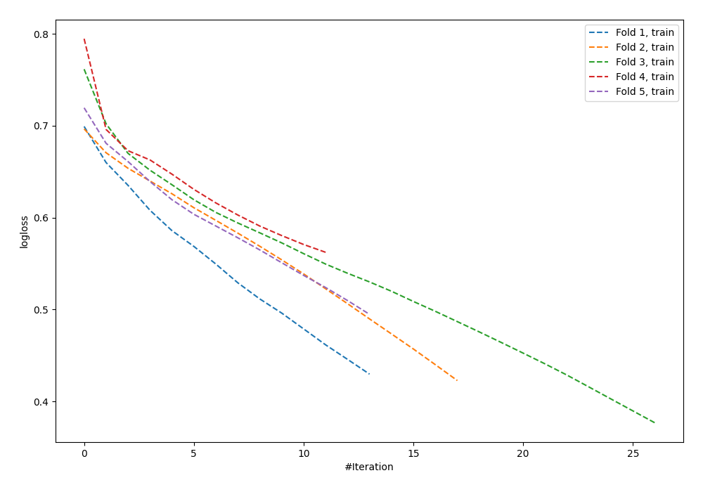

# Summary of 94_NeuralNetwork

[<< Go back](../README.md)

## Neural Network
- **n_jobs**: -1
- **dense_1_size**: 64
- **dense_2_size**: 8
- **learning_rate**: 0.01
- **explain_level**: 0

## Validation
 - **validation_type**: kfold
 - **shuffle**: True
 - **stratify**: True
 - **k_folds**: 5

## Optimized metric
logloss

## Training time

1.5 seconds

## Metric details
|           |    score |   threshold |
|:----------|---------:|------------:|
| logloss   | 0.73456  |  nan        |
| auc       | 0.534032 |  nan        |
| f1        | 0.65995  |    0.213429 |
| accuracy  | 0.552727 |    0.478616 |
| precision | 0.540541 |    0.604717 |
| recall    | 1        |    0.01134  |
| mcc       | 0.119236 |    0.345259 |

## Confusion matrix (at threshold=0.478616)
|                     |   Predicted as negative |   Predicted as positive |
|:--------------------|------------------------:|------------------------:|
| Labeled as negative |                      75 |                      66 |
| Labeled as positive |                      57 |                      77 |

## Learning curves

[<< Go back](../README.md)
