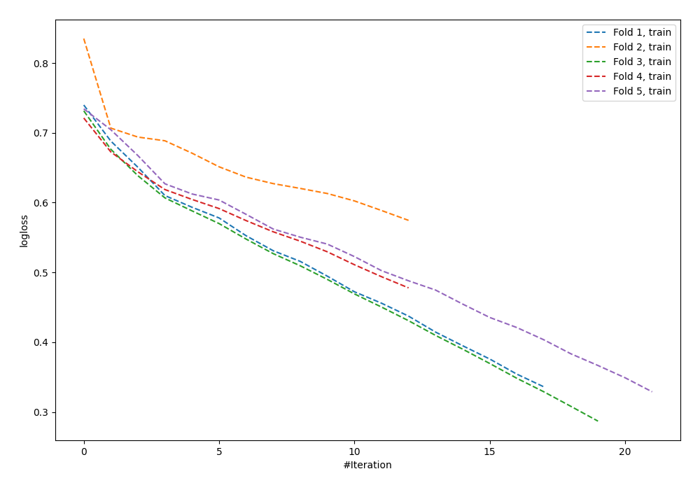

# Summary of 95_NeuralNetwork

[<< Go back](../README.md)

## Neural Network
- **n_jobs**: -1
- **dense_1_size**: 64
- **dense_2_size**: 32
- **learning_rate**: 0.01
- **explain_level**: 0

## Validation
 - **validation_type**: kfold
 - **shuffle**: True
 - **stratify**: True
 - **k_folds**: 5

## Optimized metric
logloss

## Training time

1.3 seconds

## Metric details
|           |    score |    threshold |
|:----------|---------:|-------------:|
| logloss   | 0.708982 | nan          |
| auc       | 0.567376 | nan          |
| f1        | 0.656642 |   0.213081   |
| accuracy  | 0.552727 |   0.393241   |
| precision | 0.62963  |   0.667155   |
| recall    | 1        |   0.00146001 |
| mcc       | 0.126279 |   0.371692   |

## Confusion matrix (at threshold=0.393241)
|                     |   Predicted as negative |   Predicted as positive |
|:--------------------|------------------------:|------------------------:|
| Labeled as negative |                      51 |                      90 |
| Labeled as positive |                      33 |                     101 |

## Learning curves

[<< Go back](../README.md)
