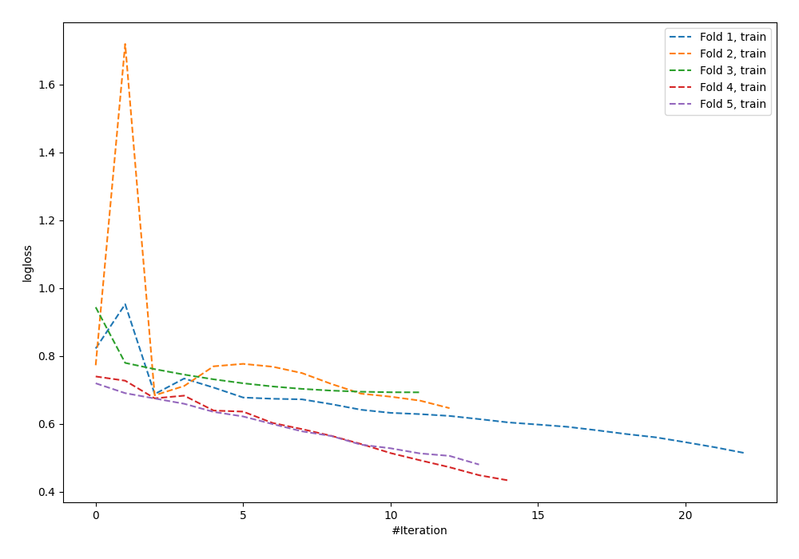

# Summary of 96_NeuralNetwork

[<< Go back](../README.md)

## Neural Network
- **n_jobs**: -1
- **dense_1_size**: 64
- **dense_2_size**: 4
- **learning_rate**: 0.1
- **explain_level**: 0

## Validation
 - **validation_type**: kfold
 - **shuffle**: True
 - **stratify**: True
 - **k_folds**: 5

## Optimized metric
logloss

## Training time

1.2 seconds

## Metric details
|           |    score |   threshold |
|:----------|---------:|------------:|
| logloss   | 0.714147 |  nan        |
| auc       | 0.553747 |  nan        |
| f1        | 0.655257 |    0.11195  |
| accuracy  | 0.567273 |    0.594585 |
| precision | 0.833333 |    0.855767 |
| recall    | 1        |    0.11195  |
| mcc       | 0.150772 |    0.594585 |

## Confusion matrix (at threshold=0.594585)
|                     |   Predicted as negative |   Predicted as positive |
|:--------------------|------------------------:|------------------------:|
| Labeled as negative |                     122 |                      19 |
| Labeled as positive |                     100 |                      34 |

## Learning curves

[<< Go back](../README.md)
