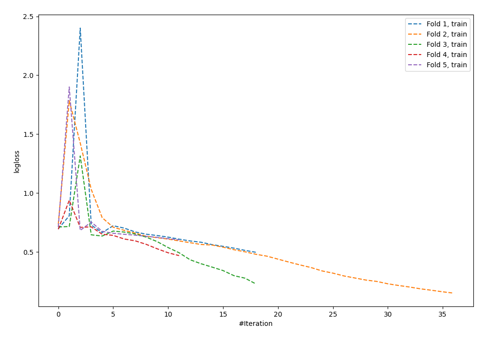

# Summary of 97_NeuralNetwork

[<< Go back](../README.md)

## Neural Network
- **n_jobs**: -1
- **dense_1_size**: 64
- **dense_2_size**: 16
- **learning_rate**: 0.1
- **explain_level**: 0

## Validation
 - **validation_type**: kfold
 - **shuffle**: True
 - **stratify**: True
 - **k_folds**: 5

## Optimized metric
logloss

## Training time

1.3 seconds

## Metric details
|           |    score |     threshold |
|:----------|---------:|--------------:|
| logloss   | 1.1071   | nan           |
| auc       | 0.532815 | nan           |
| f1        | 0.664948 |   0.0123606   |
| accuracy  | 0.549091 |   0.92689     |
| precision | 0.857143 |   0.92689     |
| recall    | 1        |   5.05145e-05 |
| mcc       | 0.171381 |   0.92689     |

## Confusion matrix (at threshold=0.92689)
|                     |   Predicted as negative |   Predicted as positive |
|:--------------------|------------------------:|------------------------:|
| Labeled as negative |                     139 |                       2 |
| Labeled as positive |                     122 |                      12 |

## Learning curves

[<< Go back](../README.md)
