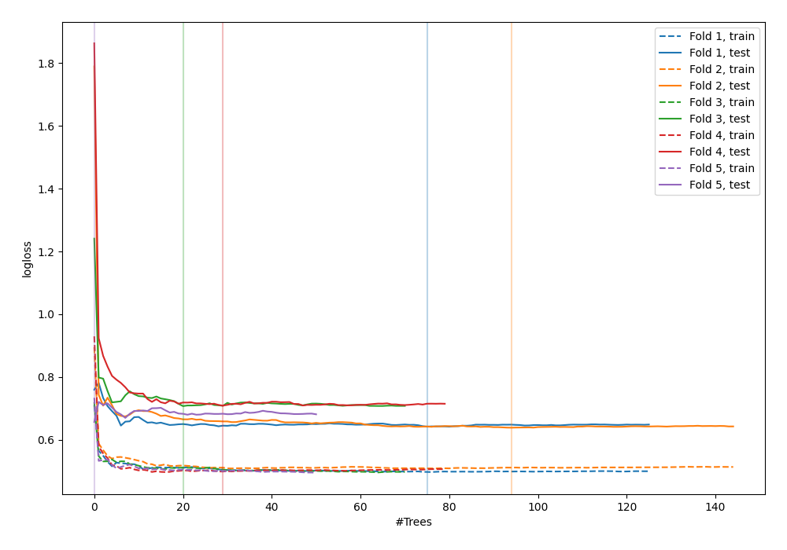

# Summary of 9_Default_RandomForest

[<< Go back](../README.md)

## Random Forest
- **n_jobs**: -1
- **criterion**: gini
- **max_features**: 0.9
- **min_samples_split**: 30
- **max_depth**: 4
- **explain_level**: 0

## Validation
 - **validation_type**: kfold
 - **shuffle**: True
 - **stratify**: True
 - **k_folds**: 5

## Optimized metric
logloss

## Training time

4.3 seconds

## Metric details
|           |    score |   threshold |
|:----------|---------:|------------:|
| logloss   | 0.670234 |  nan        |
| auc       | 0.636472 |  nan        |
| f1        | 0.677966 |    0.342796 |
| accuracy  | 0.610909 |    0.439393 |
| precision | 0.673913 |    0.669303 |
| recall    | 1        |    0        |
| mcc       | 0.235266 |    0.397808 |

## Confusion matrix (at threshold=0.439393)
|                     |   Predicted as negative |   Predicted as positive |
|:--------------------|------------------------:|------------------------:|
| Labeled as negative |                      69 |                      72 |
| Labeled as positive |                      35 |                      99 |

## Learning curves

[<< Go back](../README.md)
