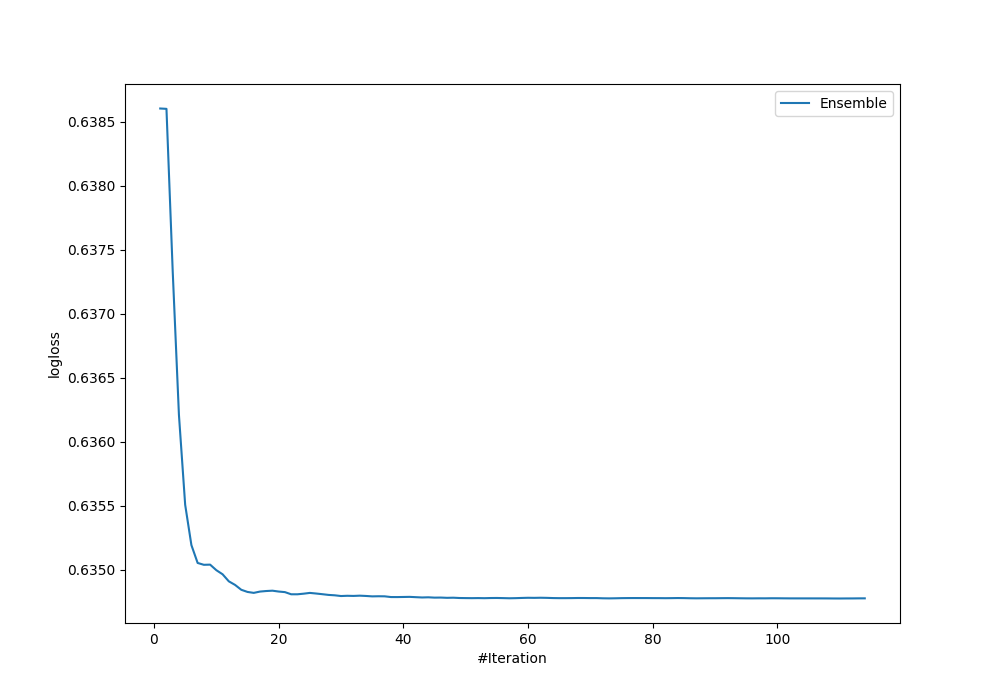

# Summary of Ensemble

[<< Go back](../README.md)

## Ensemble structure
| Model                             |   Weight |
|:----------------------------------|---------:|
| 102_CatBoost                      |        7 |
| 10_Default_ExtraTrees             |        6 |
| 27_LightGBM_SelectedFeatures      |        8 |
| 35_CatBoost                       |       47 |
| 35_CatBoost_GoldenFeatures        |        5 |
| 35_CatBoost_SelectedFeatures      |        2 |
| 44_RandomForest_GoldenFeatures    |       15 |
| 61_NeuralNetwork_SelectedFeatures |        2 |
| 87_Xgboost                        |        4 |
| 88_RandomForest                   |       14 |

## Metric details
|           |    score |   threshold |
|:----------|---------:|------------:|
| logloss   | 0.634777 |  nan        |
| auc       | 0.699852 |  nan        |
| f1        | 0.681564 |    0.374044 |
| accuracy  | 0.665455 |    0.497761 |
| precision | 1        |    0.696198 |
| recall    | 1        |    0.172961 |
| mcc       | 0.330046 |    0.493765 |

## Confusion matrix (at threshold=0.497761)
|                     |   Predicted as negative |   Predicted as positive |
|:--------------------|------------------------:|------------------------:|
| Labeled as negative |                      99 |                      42 |
| Labeled as positive |                      50 |                      84 |

## Learning curves

[<< Go back](../README.md)
