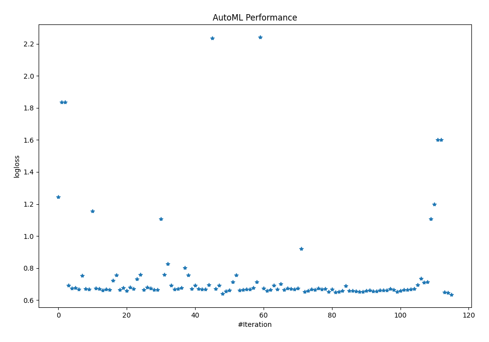
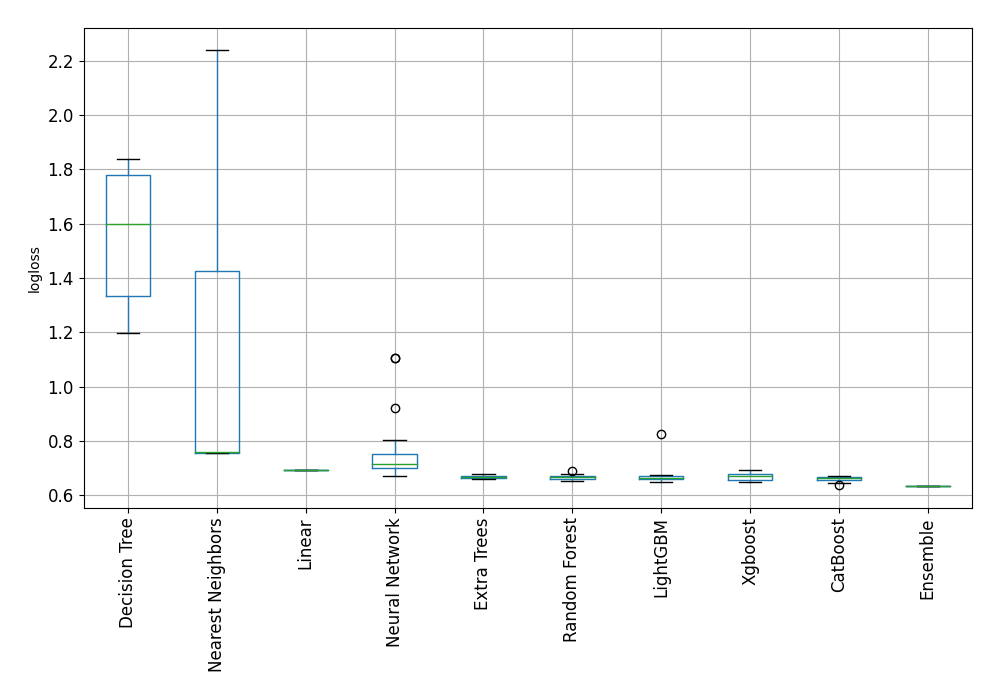

# AutoML Leaderboard

| Best model   | name                                                                             | model_type        | metric_type   |   metric_value |   train_time |
|:-------------|:---------------------------------------------------------------------------------|:------------------|:--------------|---------------:|-------------:|
|              | [1_DecisionTree](1_DecisionTree/README.md)                                       | Decision Tree     | logloss       |       1.2431   |         0.96 |
|              | [2_DecisionTree](2_DecisionTree/README.md)                                       | Decision Tree     | logloss       |       1.8371   |         0.82 |
|              | [3_DecisionTree](3_DecisionTree/README.md)                                       | Decision Tree     | logloss       |       1.8371   |         0.78 |
|              | [4_Linear](4_Linear/README.md)                                                   | Linear            | logloss       |       0.693097 |         3.4  |
|              | [5_Default_LightGBM](5_Default_LightGBM/README.md)                               | LightGBM          | logloss       |       0.674363 |         1.21 |
|              | [6_Default_Xgboost](6_Default_Xgboost/README.md)                                 | Xgboost           | logloss       |       0.677681 |         1.89 |
|              | [7_Default_CatBoost](7_Default_CatBoost/README.md)                               | CatBoost          | logloss       |       0.667725 |         2.76 |
|              | [8_Default_NeuralNetwork](8_Default_NeuralNetwork/README.md)                     | Neural Network    | logloss       |       0.75232  |         1.05 |
|              | [9_Default_RandomForest](9_Default_RandomForest/README.md)                       | Random Forest     | logloss       |       0.670234 |         4.67 |
|              | [10_Default_ExtraTrees](10_Default_ExtraTrees/README.md)                         | Extra Trees       | logloss       |       0.666682 |         2.9  |
|              | [11_Default_NearestNeighbors](11_Default_NearestNeighbors/README.md)             | Nearest Neighbors | logloss       |       1.15551  |         0.92 |
|              | [21_LightGBM](21_LightGBM/README.md)                                             | LightGBM          | logloss       |       0.67204  |         0.99 |
|              | [12_Xgboost](12_Xgboost/README.md)                                               | Xgboost           | logloss       |       0.671053 |         1.31 |
|              | [30_CatBoost](30_CatBoost/README.md)                                             | CatBoost          | logloss       |       0.660505 |         4.21 |
|              | [39_RandomForest](39_RandomForest/README.md)                                     | Random Forest     | logloss       |       0.667254 |         3.57 |
|              | [48_ExtraTrees](48_ExtraTrees/README.md)                                         | Extra Trees       | logloss       |       0.665569 |         3.67 |
|              | [57_NeuralNetwork](57_NeuralNetwork/README.md)                                   | Neural Network    | logloss       |       0.722876 |         0.98 |
|              | [66_NearestNeighbors](66_NearestNeighbors/README.md)                             | Nearest Neighbors | logloss       |       0.755946 |         0.98 |
|              | [22_LightGBM](22_LightGBM/README.md)                                             | LightGBM          | logloss       |       0.663059 |         0.99 |
|              | [13_Xgboost](13_Xgboost/README.md)                                               | Xgboost           | logloss       |       0.676916 |         1.53 |
|              | [31_CatBoost](31_CatBoost/README.md)                                             | CatBoost          | logloss       |       0.656563 |         4.94 |
|              | [40_RandomForest](40_RandomForest/README.md)                                     | Random Forest     | logloss       |       0.677999 |         3.97 |
|              | [49_ExtraTrees](49_ExtraTrees/README.md)                                         | Extra Trees       | logloss       |       0.670773 |         5.3  |
|              | [58_NeuralNetwork](58_NeuralNetwork/README.md)                                   | Neural Network    | logloss       |       0.731949 |         1.51 |
|              | [67_NearestNeighbors](67_NearestNeighbors/README.md)                             | Nearest Neighbors | logloss       |       0.760141 |         0.97 |
|              | [23_LightGBM](23_LightGBM/README.md)                                             | LightGBM          | logloss       |       0.664155 |         1.08 |
|              | [14_Xgboost](14_Xgboost/README.md)                                               | Xgboost           | logloss       |       0.680822 |         1.25 |
|              | [32_CatBoost](32_CatBoost/README.md)                                             | CatBoost          | logloss       |       0.672803 |         3.06 |
|              | [41_RandomForest](41_RandomForest/README.md)                                     | Random Forest     | logloss       |       0.66418  |         3.99 |
|              | [50_ExtraTrees](50_ExtraTrees/README.md)                                         | Extra Trees       | logloss       |       0.66509  |         4.71 |
|              | [59_NeuralNetwork](59_NeuralNetwork/README.md)                                   | Neural Network    | logloss       |       1.10652  |         1.79 |
|              | [68_NearestNeighbors](68_NearestNeighbors/README.md)                             | Nearest Neighbors | logloss       |       0.760141 |         0.97 |
|              | [24_LightGBM](24_LightGBM/README.md)                                             | LightGBM          | logloss       |       0.827197 |         1.17 |
|              | [15_Xgboost](15_Xgboost/README.md)                                               | Xgboost           | logloss       |       0.693043 |         9.39 |
|              | [33_CatBoost](33_CatBoost/README.md)                                             | CatBoost          | logloss       |       0.66803  |         4.47 |
|              | [42_RandomForest](42_RandomForest/README.md)                                     | Random Forest     | logloss       |       0.670414 |         5.6  |
|              | [51_ExtraTrees](51_ExtraTrees/README.md)                                         | Extra Trees       | logloss       |       0.677425 |         4.59 |
|              | [60_NeuralNetwork](60_NeuralNetwork/README.md)                                   | Neural Network    | logloss       |       0.802872 |         1.09 |
|              | [69_NearestNeighbors](69_NearestNeighbors/README.md)                             | Nearest Neighbors | logloss       |       0.755946 |         1.01 |
|              | [25_LightGBM](25_LightGBM/README.md)                                             | LightGBM          | logloss       |       0.669335 |         0.92 |
|              | [16_Xgboost](16_Xgboost/README.md)                                               | Xgboost           | logloss       |       0.692846 |         0.92 |
|              | [34_CatBoost](34_CatBoost/README.md)                                             | CatBoost          | logloss       |       0.669612 |         2.21 |
|              | [43_RandomForest](43_RandomForest/README.md)                                     | Random Forest     | logloss       |       0.666582 |         3.16 |
|              | [52_ExtraTrees](52_ExtraTrees/README.md)                                         | Extra Trees       | logloss       |       0.668151 |         3.26 |
|              | [61_NeuralNetwork](61_NeuralNetwork/README.md)                                   | Neural Network    | logloss       |       0.693315 |         1.53 |
|              | [70_NearestNeighbors](70_NearestNeighbors/README.md)                             | Nearest Neighbors | logloss       |       2.23506  |         0.52 |
|              | [26_LightGBM](26_LightGBM/README.md)                                             | LightGBM          | logloss       |       0.669006 |         1.16 |
|              | [17_Xgboost](17_Xgboost/README.md)                                               | Xgboost           | logloss       |       0.692742 |         0.71 |
|              | [35_CatBoost](35_CatBoost/README.md)                                             | CatBoost          | logloss       |       0.638605 |         1.87 |
|              | [44_RandomForest](44_RandomForest/README.md)                                     | Random Forest     | logloss       |       0.655349 |         3.5  |
|              | [53_ExtraTrees](53_ExtraTrees/README.md)                                         | Extra Trees       | logloss       |       0.66037  |         4.64 |
|              | [62_NeuralNetwork](62_NeuralNetwork/README.md)                                   | Neural Network    | logloss       |       0.713433 |         1.52 |
|              | [71_NearestNeighbors](71_NearestNeighbors/README.md)                             | Nearest Neighbors | logloss       |       0.755946 |         1.46 |
|              | [27_LightGBM](27_LightGBM/README.md)                                             | LightGBM          | logloss       |       0.660277 |         1.13 |
|              | [18_Xgboost](18_Xgboost/README.md)                                               | Xgboost           | logloss       |       0.663813 |         1.33 |
|              | [36_CatBoost](36_CatBoost/README.md)                                             | CatBoost          | logloss       |       0.666067 |         6.25 |
|              | [45_RandomForest](45_RandomForest/README.md)                                     | Random Forest     | logloss       |       0.668144 |         3.76 |
|              | [54_ExtraTrees](54_ExtraTrees/README.md)                                         | Extra Trees       | logloss       |       0.676104 |         3.99 |
|              | [63_NeuralNetwork](63_NeuralNetwork/README.md)                                   | Neural Network    | logloss       |       0.714506 |         1.08 |
|              | [72_NearestNeighbors](72_NearestNeighbors/README.md)                             | Nearest Neighbors | logloss       |       2.24136  |         0.5  |
|              | [28_LightGBM](28_LightGBM/README.md)                                             | LightGBM          | logloss       |       0.672891 |         1.21 |
|              | [19_Xgboost](19_Xgboost/README.md)                                               | Xgboost           | logloss       |       0.65833  |         1.29 |
|              | [37_CatBoost](37_CatBoost/README.md)                                             | CatBoost          | logloss       |       0.664356 |         2.82 |
|              | [46_RandomForest](46_RandomForest/README.md)                                     | Random Forest     | logloss       |       0.690428 |         4.41 |
|              | [55_ExtraTrees](55_ExtraTrees/README.md)                                         | Extra Trees       | logloss       |       0.667633 |         3.67 |
|              | [64_NeuralNetwork](64_NeuralNetwork/README.md)                                   | Neural Network    | logloss       |       0.701443 |         1.68 |
|              | [29_LightGBM](29_LightGBM/README.md)                                             | LightGBM          | logloss       |       0.66389  |         1.22 |
|              | [20_Xgboost](20_Xgboost/README.md)                                               | Xgboost           | logloss       |       0.673569 |         2.13 |
|              | [38_CatBoost](38_CatBoost/README.md)                                             | CatBoost          | logloss       |       0.669646 |         5.69 |
|              | [47_RandomForest](47_RandomForest/README.md)                                     | Random Forest     | logloss       |       0.665717 |         3.74 |
|              | [56_ExtraTrees](56_ExtraTrees/README.md)                                         | Extra Trees       | logloss       |       0.671959 |         3.6  |
|              | [65_NeuralNetwork](65_NeuralNetwork/README.md)                                   | Neural Network    | logloss       |       0.921556 |         1.1  |
|              | [35_CatBoost_GoldenFeatures](35_CatBoost_GoldenFeatures/README.md)               | CatBoost          | logloss       |       0.651952 |         3.59 |
|              | [44_RandomForest_GoldenFeatures](44_RandomForest_GoldenFeatures/README.md)       | Random Forest     | logloss       |       0.657788 |         3.81 |
|              | [31_CatBoost_GoldenFeatures](31_CatBoost_GoldenFeatures/README.md)               | CatBoost          | logloss       |       0.666085 |         5.6  |
|              | [35_CatBoost_KMeansFeatures](35_CatBoost_KMeansFeatures/README.md)               | CatBoost          | logloss       |       0.664167 |         3.2  |
|              | [44_RandomForest_KMeansFeatures](44_RandomForest_KMeansFeatures/README.md)       | Random Forest     | logloss       |       0.673086 |         6.01 |
|              | [31_CatBoost_KMeansFeatures](31_CatBoost_KMeansFeatures/README.md)               | CatBoost          | logloss       |       0.667554 |         7.97 |
|              | [35_CatBoost_RandomFeature](35_CatBoost_RandomFeature/README.md)                 | CatBoost          | logloss       |       0.668975 |        65.05 |
|              | [35_CatBoost_SelectedFeatures](35_CatBoost_SelectedFeatures/README.md)           | CatBoost          | logloss       |       0.650614 |         1.75 |
|              | [44_RandomForest_SelectedFeatures](44_RandomForest_SelectedFeatures/README.md)   | Random Forest     | logloss       |       0.666876 |         3.41 |
|              | [19_Xgboost_SelectedFeatures](19_Xgboost_SelectedFeatures/README.md)             | Xgboost           | logloss       |       0.65014  |         1.42 |
|              | [27_LightGBM_SelectedFeatures](27_LightGBM_SelectedFeatures/README.md)           | LightGBM          | logloss       |       0.650619 |         1.16 |
|              | [53_ExtraTrees_SelectedFeatures](53_ExtraTrees_SelectedFeatures/README.md)       | Extra Trees       | logloss       |       0.658515 |         3.14 |
|              | [61_NeuralNetwork_SelectedFeatures](61_NeuralNetwork_SelectedFeatures/README.md) | Neural Network    | logloss       |       0.689637 |         2.05 |
|              | [73_CatBoost](73_CatBoost/README.md)                                             | CatBoost          | logloss       |       0.658898 |         2.26 |
|              | [74_Xgboost_SelectedFeatures](74_Xgboost_SelectedFeatures/README.md)             | Xgboost           | logloss       |       0.657656 |         1.24 |
|              | [75_CatBoost_SelectedFeatures](75_CatBoost_SelectedFeatures/README.md)           | CatBoost          | logloss       |       0.65629  |         1.49 |
|              | [76_LightGBM_SelectedFeatures](76_LightGBM_SelectedFeatures/README.md)           | LightGBM          | logloss       |       0.650619 |         1.12 |
|              | [77_LightGBM_SelectedFeatures](77_LightGBM_SelectedFeatures/README.md)           | LightGBM          | logloss       |       0.650619 |         1.04 |
|              | [78_CatBoost_GoldenFeatures](78_CatBoost_GoldenFeatures/README.md)               | CatBoost          | logloss       |       0.656867 |         3.12 |
|              | [79_RandomForest](79_RandomForest/README.md)                                     | Random Forest     | logloss       |       0.661036 |         3.39 |
|              | [80_RandomForest_GoldenFeatures](80_RandomForest_GoldenFeatures/README.md)       | Random Forest     | logloss       |       0.654139 |         4    |
|              | [81_Xgboost](81_Xgboost/README.md)                                               | Xgboost           | logloss       |       0.65393  |         1.3  |
|              | [82_ExtraTrees_SelectedFeatures](82_ExtraTrees_SelectedFeatures/README.md)       | Extra Trees       | logloss       |       0.66216  |         3.4  |
|              | [83_LightGBM](83_LightGBM/README.md)                                             | LightGBM          | logloss       |       0.660277 |         1.01 |
|              | [84_LightGBM](84_LightGBM/README.md)                                             | LightGBM          | logloss       |       0.660277 |         1.02 |
|              | [85_ExtraTrees](85_ExtraTrees/README.md)                                         | Extra Trees       | logloss       |       0.670074 |         3.62 |
|              | [86_LightGBM](86_LightGBM/README.md)                                             | LightGBM          | logloss       |       0.663059 |         1.27 |
|              | [87_Xgboost](87_Xgboost/README.md)                                               | Xgboost           | logloss       |       0.651832 |         1.33 |
|              | [88_RandomForest](88_RandomForest/README.md)                                     | Random Forest     | logloss       |       0.657544 |         3.4  |
|              | [89_RandomForest](89_RandomForest/README.md)                                     | Random Forest     | logloss       |       0.664629 |         3.29 |
|              | [90_ExtraTrees](90_ExtraTrees/README.md)                                         | Extra Trees       | logloss       |       0.664382 |         3.67 |
|              | [91_ExtraTrees](91_ExtraTrees/README.md)                                         | Extra Trees       | logloss       |       0.667908 |         3.84 |
|              | [92_NeuralNetwork_SelectedFeatures](92_NeuralNetwork_SelectedFeatures/README.md) | Neural Network    | logloss       |       0.670033 |         1.08 |
|              | [93_NeuralNetwork_SelectedFeatures](93_NeuralNetwork_SelectedFeatures/README.md) | Neural Network    | logloss       |       0.695508 |         1.87 |
|              | [94_NeuralNetwork](94_NeuralNetwork/README.md)                                   | Neural Network    | logloss       |       0.73456  |         1.72 |
|              | [95_NeuralNetwork](95_NeuralNetwork/README.md)                                   | Neural Network    | logloss       |       0.708982 |         1.57 |
|              | [96_NeuralNetwork](96_NeuralNetwork/README.md)                                   | Neural Network    | logloss       |       0.714147 |         1.47 |
|              | [97_NeuralNetwork](97_NeuralNetwork/README.md)                                   | Neural Network    | logloss       |       1.1071   |         1.53 |
|              | [98_DecisionTree](98_DecisionTree/README.md)                                     | Decision Tree     | logloss       |       1.19886  |         1.07 |
|              | [99_DecisionTree](99_DecisionTree/README.md)                                     | Decision Tree     | logloss       |       1.60097  |         0.91 |
|              | [100_DecisionTree](100_DecisionTree/README.md)                                   | Decision Tree     | logloss       |       1.60097  |         1.28 |
|              | [101_CatBoost](101_CatBoost/README.md)                                           | CatBoost          | logloss       |       0.650263 |         4.44 |
|              | [102_CatBoost](102_CatBoost/README.md)                                           | CatBoost          | logloss       |       0.646707 |        97.37 |
| **the best** | [Ensemble](Ensemble/README.md)                                                   | Ensemble          | logloss       |       0.634777 |        61.66 |

### AutoML Performance

### AutoML Performance Boxplot
