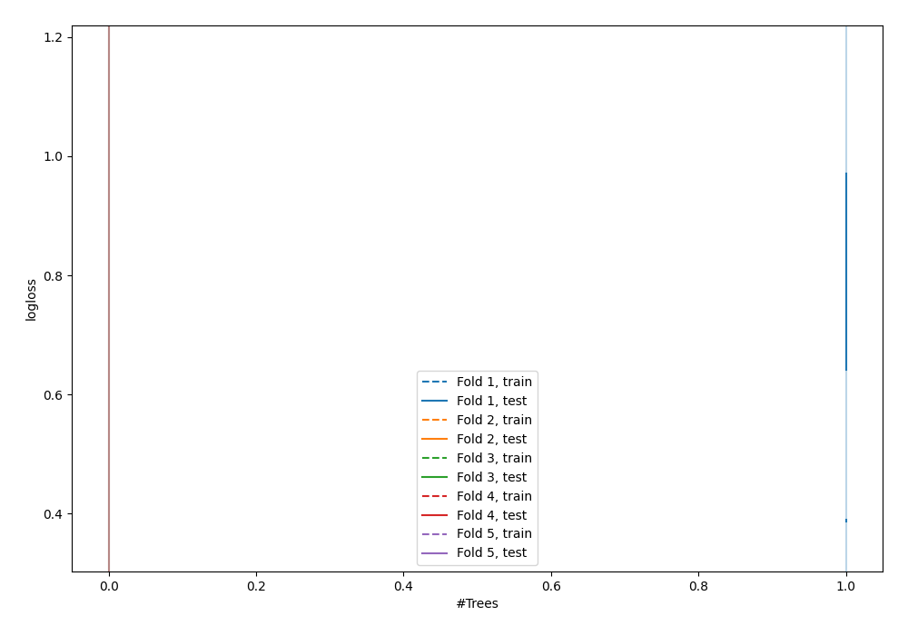

# Summary of 1_DecisionTree

[<< Go back](../README.md)

## Decision Tree
- **n_jobs**: -1
- **criterion**: gini
- **max_depth**: 3
- **explain_level**: 0

## Validation
 - **validation_type**: kfold
 - **shuffle**: True
 - **stratify**: True
 - **k_folds**: 5

## Optimized metric
logloss

## Training time

0.7 seconds

## Metric details
|           |    score |   threshold |
|:----------|---------:|------------:|
| logloss   | 0.801326 |  nan        |
| auc       | 0.784649 |  nan        |
| f1        | 0.762238 |    0.638498 |
| accuracy  | 0.76     |    0.741935 |
| precision | 1        |    0.943662 |
| recall    | 0.966443 |    0        |
| mcc       | 0.533655 |    0.741935 |

## Confusion matrix (at threshold=0.741935)
|                     |   Predicted as negative |   Predicted as positive |
|:--------------------|------------------------:|------------------------:|
| Labeled as negative |                     106 |                      20 |
| Labeled as positive |                      46 |                     103 |

## Learning curves

[<< Go back](../README.md)
