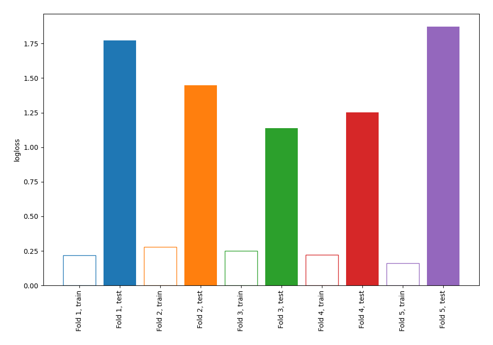

# Summary of 2_DecisionTree

[<< Go back](../README.md)

## Decision Tree
- **n_jobs**: -1
- **criterion**: gini
- **max_depth**: 4
- **explain_level**: 0

## Validation
 - **validation_type**: kfold
 - **shuffle**: True
 - **stratify**: True
 - **k_folds**: 5

## Optimized metric
logloss

## Training time

0.2 seconds

## Metric details
|           |    score |   threshold |
|:----------|---------:|------------:|
| logloss   | 1.49663  |  nan        |
| auc       | 0.797379 |  nan        |
| f1        | 0.775148 |    0.118644 |
| accuracy  | 0.76     |    0.84     |
| precision | 0.854701 |    0.84     |
| recall    | 0.90604  |    0        |
| mcc       | 0.540381 |    0.84     |

## Confusion matrix (at threshold=0.84)
|                     |   Predicted as negative |   Predicted as positive |
|:--------------------|------------------------:|------------------------:|
| Labeled as negative |                     109 |                      17 |
| Labeled as positive |                      49 |                     100 |

## Learning curves

[<< Go back](../README.md)
