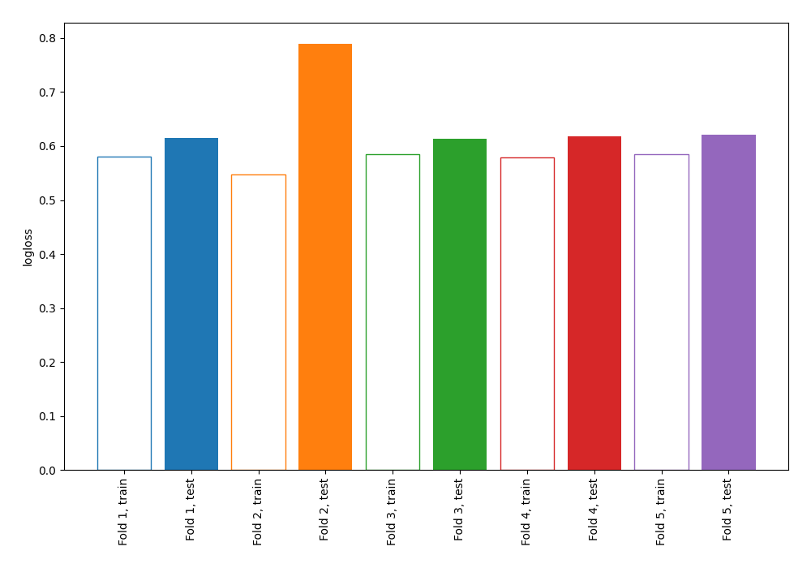

# Summary of 4_Linear

[<< Go back](../README.md)

## Logistic Regression (Linear)
- **n_jobs**: -1
- **explain_level**: 0

## Validation
 - **validation_type**: kfold
 - **shuffle**: True
 - **stratify**: True
 - **k_folds**: 5

## Optimized metric
logloss

## Training time

2.7 seconds

## Metric details
|           |    score |   threshold |
|:----------|---------:|------------:|
| logloss   | 0.651103 | nan         |
| auc       | 0.684777 | nan         |
| f1        | 0.726257 |   0.38605   |
| accuracy  | 0.647273 |   0.504604  |
| precision | 0.868421 |   0.755373  |
| recall    | 1        |   0.0199866 |
| mcc       | 0.286407 |   0.38605   |

## Confusion matrix (at threshold=0.504604)
|                     |   Predicted as negative |   Predicted as positive |
|:--------------------|------------------------:|------------------------:|
| Labeled as negative |                      70 |                      56 |
| Labeled as positive |                      41 |                     108 |

## Learning curves

[<< Go back](../README.md)
