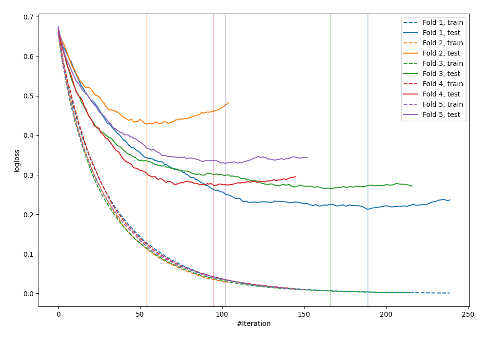

# Summary of 5_Default_LightGBM

[<< Go back](../README.md)

## LightGBM
- **n_jobs**: -1
- **objective**: binary
- **metric**: binary_logloss
- **num_leaves**: 63
- **learning_rate**: 0.05
- **feature_fraction**: 0.9
- **bagging_fraction**: 0.9
- **min_data_in_leaf**: 10
- **explain_level**: 0

## Validation
 - **validation_type**: kfold
 - **shuffle**: True
 - **stratify**: True
 - **k_folds**: 5

## Optimized metric
logloss

## Training time

1.2 seconds

## Metric details
|           |    score |     threshold |
|:----------|---------:|--------------:|
| logloss   | 0.301896 | nan           |
| auc       | 0.945137 | nan           |
| f1        | 0.883117 |   0.398713    |
| accuracy  | 0.869091 |   0.552993    |
| precision | 1        |   0.981703    |
| recall    | 1        |   0.000655446 |
| mcc       | 0.736739 |   0.552993    |

## Confusion matrix (at threshold=0.552993)
|                     |   Predicted as negative |   Predicted as positive |
|:--------------------|------------------------:|------------------------:|
| Labeled as negative |                     109 |                      17 |
| Labeled as positive |                      19 |                     130 |

## Learning curves

[<< Go back](../README.md)
