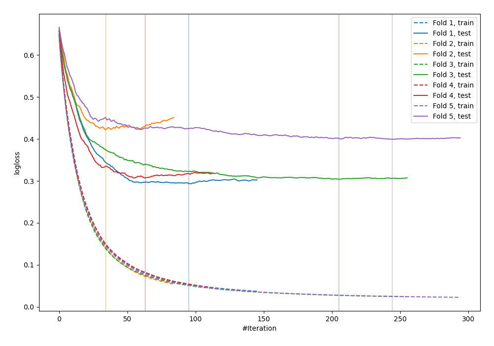

# Summary of 6_Default_Xgboost

[<< Go back](../README.md)

## Extreme Gradient Boosting (Xgboost)
- **n_jobs**: -1
- **objective**: binary:logistic
- **eval_metric**: logloss
- **eta**: 0.075
- **max_depth**: 6
- **min_child_weight**: 1
- **subsample**: 1.0
- **colsample_bytree**: 1.0
- **explain_level**: 0

## Validation
 - **validation_type**: kfold
 - **shuffle**: True
 - **stratify**: True
 - **k_folds**: 5

## Optimized metric
logloss

## Training time

1.8 seconds

## Metric details
|           |    score |    threshold |
|:----------|---------:|-------------:|
| logloss   | 0.345206 | nan          |
| auc       | 0.926281 | nan          |
| f1        | 0.87013  |   0.387772   |
| accuracy  | 0.854545 |   0.387772   |
| precision | 1        |   0.965054   |
| recall    | 1        |   0.00614707 |
| mcc       | 0.715985 |   0.644146   |

## Confusion matrix (at threshold=0.387772)
|                     |   Predicted as negative |   Predicted as positive |
|:--------------------|------------------------:|------------------------:|
| Labeled as negative |                     101 |                      25 |
| Labeled as positive |                      15 |                     134 |

## Learning curves

[<< Go back](../README.md)
