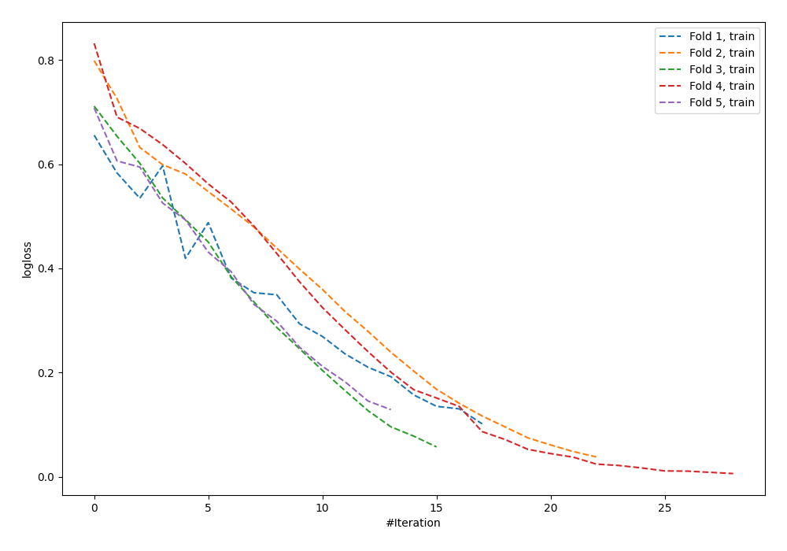

# Summary of 8_Default_NeuralNetwork

[<< Go back](../README.md)

## Neural Network
- **n_jobs**: -1
- **dense_1_size**: 32
- **dense_2_size**: 16
- **learning_rate**: 0.05
- **explain_level**: 0

## Validation
 - **validation_type**: kfold
 - **shuffle**: True
 - **stratify**: True
 - **k_folds**: 5

## Optimized metric
logloss

## Training time

0.8 seconds

## Metric details
|           |    score |     threshold |
|:----------|---------:|--------------:|
| logloss   | 0.688063 | nan           |
| auc       | 0.751997 | nan           |
| f1        | 0.749206 |   0.538282    |
| accuracy  | 0.716364 |   0.564699    |
| precision | 0.833333 |   0.937103    |
| recall    | 1        |   8.03151e-06 |
| mcc       | 0.426658 |   0.564699    |

## Confusion matrix (at threshold=0.564699)
|                     |   Predicted as negative |   Predicted as positive |
|:--------------------|------------------------:|------------------------:|
| Labeled as negative |                      83 |                      43 |
| Labeled as positive |                      35 |                     114 |

## Learning curves

[<< Go back](../README.md)
